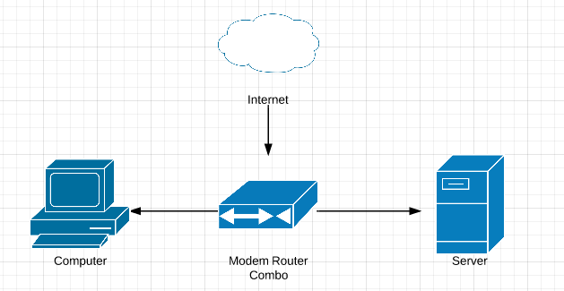
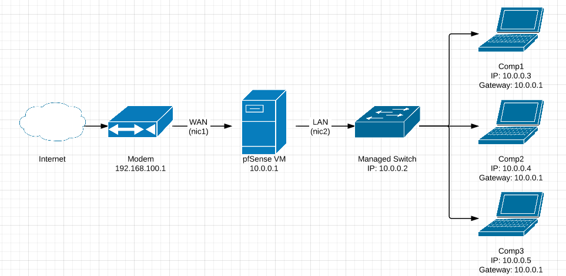
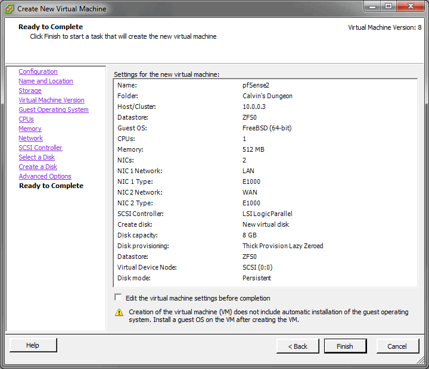
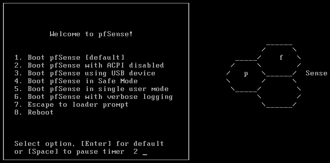
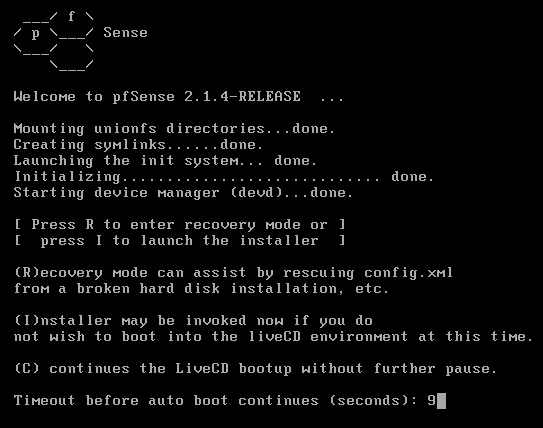
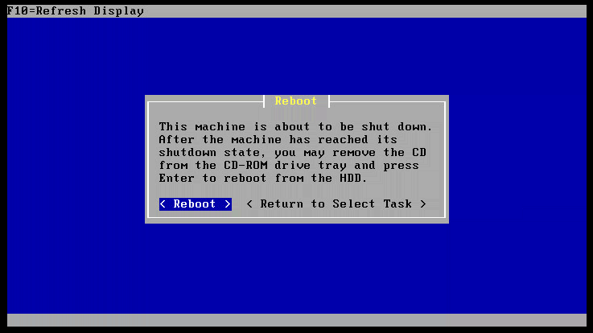

pfSense is an open source firewall/router based on FreeBSD. It is more than just however, with the ability to be a DNS, VPN, IDS/IPS, DHCP, NTP and cache (using Squid). Why would you dedicate a full system to pfSense when it can easily run as a virtual machine to provide networking to your entire infrastructure.  This guide will walk you through replacing your current router with pfSense and how to install pfSense on ESXi.

<!-- more -->

## What you will need:

*   A computer or laptop - to do the configuring
*   ESXi - the hypervisor it will run on
*   Modem - used to connect to the Internet, can be your current modem/router combo
*   RJ45 cables
*   At least two network cards in your server, although you can use one it is easier to spread your connections out as LAN and WAN.
*   KVM or monitor to ESXi, required when changing its IP address.

## Prerequisites:

### Think of the private address range you want

Private addresses are:

*   10.0.0.0 to 10.255.255.255 (16777216 addresses)
*   172.16.0.0 to 172.31.255.255 (1048576 addresses)
*   192.168.0.0 to 192.168.255.255 (65536 addresses)

My current home network is on the 192.168.X.X network but I am hoping to change it to 10.X.X.X to save myself some typing. pfSense uses the 192.168.1.X network by default.

### Have a video and keyboard connection to your ESXi box somehow.

The best way would be a physical screen and monitor (what I will use), KVM or IPMI (set a static address or else keep in mind the IP address of IPMI may be out of range once you change once you begin to work with the new address range.).This is because you will need to access pfSense, change your ESXi IP to get an address etc.

## Let's Start!

Currently your setup may look similar to something like this: 

We want it to look something like this:

_Our modem becomes independent of the router. pfSense becomes the router living as a VM on our ESXi host. A switch may not be needed, but they're great to have._:

pfSense as a virtual machine will sit between your modem and switch to act as a router. It will be able to provide IP addresses to both physical and virtual machines via it's DHCP server (or you can set the IP manually). One network card on your ESXi host will connect to the modem (WAN) while the other connects to the your switch (LAN). Without a switch, you will only be able to connect one host to your network  as there is only one connection!

## Installation

**1. Set up a LAN and WAN switch in the vSphere client.** One NIC (network card) will be the LAN and one NIC will be the WAN. The LAN NIC will act as a router to your VMs as well as anything connected to the switch. The WAN will be connected to your modem to access and provide Internet connectivity to your LAN.

_Two vSwitches using two different network cards. One network card is responsible for the local network and one is dedicated to the wide area network (Internet)_:

Give the names WAN and LAN corresponding to the which ever NIC is connected to the Modem (WAN) and Switch (LAN).

**2. Create a new Virtual machine with the follow settings:**

**3. Load the pfSense ISO image into the VM and boot from it.**

Straightforward enough. Make sure to boot from the CD/DVD drive.

**4. Go with the default boot (number 1) or let the timer run down.**

**5. Press 'I' when prompted again to start the installer.**

Otherwise you will be running a LiveCD. Restart if this happens.

**6. Accept all the default settings and wait for it to finish installing.**

**7. Reboot when finished.**

pfSense has now been installed. It isn't doing anything yet so we will need to configure and transition our network over to it.

Continued in [Part 2: Install pfSense on ESXI 5.5](/part-2-install-pfsense-esxi-5-5/) where we will configure the new installation.
