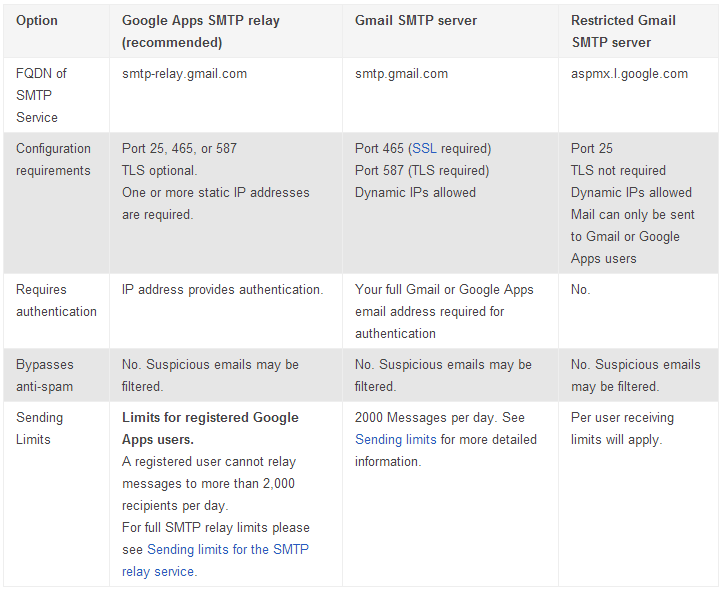
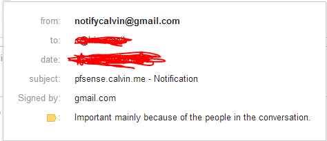
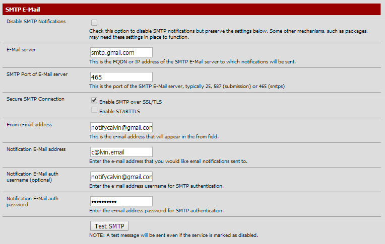
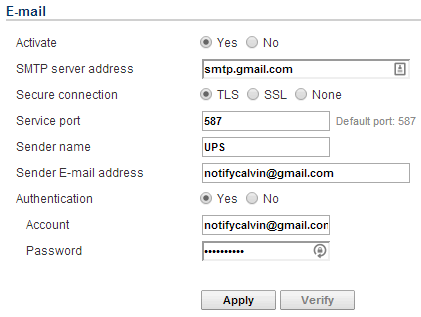

A lot of (the good ones at least) hardware and software give you the ability to send notifications via email when scheduled too or a warning/error occurs. Without having to build and maintain your own mail server, you can use the Google SMTP server as your sending mail server.

<!-- more -->

You will also have the option of having Google store and index the emails you send, so all your sent emails will be searchable and backed-up on Gmail. If you elect to use your Gmail or Google Apps account for your incoming email as well, you'll have all your email in one convenient place. Also, since Google's SMTP server does not use Port 25, you'll reduce the probability that an ISP might block your email or flag it as SPAM.

_Table from :_



## To utilise the Google SMTP server:

```
Server: smtp.gmail.com
Port: 465
Username: Your Gmail or Google Apps email address
Password: Your Gmail or Google Apps email password
TLS/SSL required: Yes
Authentication: Yes
Security: SSL
```

The following is also a working combination:

```
Security: TLS
Port: 587
```

## Store outgoing emails

Copies of outgoing emails are stored in the Gmail/Google Apps 'Sent folder'.

1.  Log into your Gmail or Google Apps email
2.  Click on "Settings" then on the "Forwarding/IMAP" tab
3.  Scroll down to the "IMAP Access" section. IMAP must be enabled in order for emails to be properly copied to your sent folder.

NOTE: Google rewrites the 'From' address emails to the default 'Send' email address in your Gmail/Google Apps account settings. To fix this,  go to the "Accounts" tab and make another account the  "default" Gmail/Google Apps account.

_Example email details_:



_Test email from pfSense using the Google SMTP Server_:


## Sending Limits
There is a limit of 2000 emails per day. Plenty.

## Start Using It Everywhere
_pfSense_:



_CyberPower UPS PowerPanel - to let me know when the power goes out at home_:



_napp-it which is set to notify of disk failures and daily/weekly/monthly status_:


_Ubiquiti UniFi Controller which monitors my wireless access points_:


