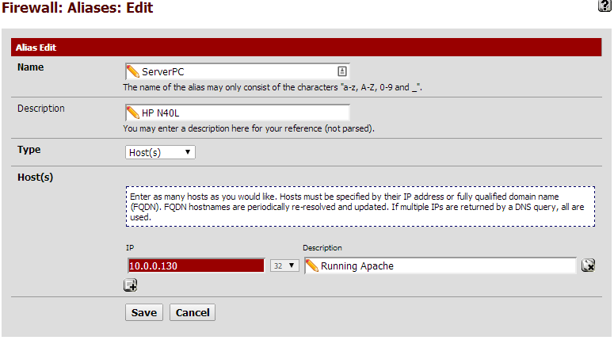
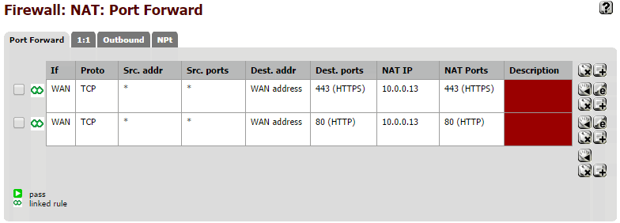
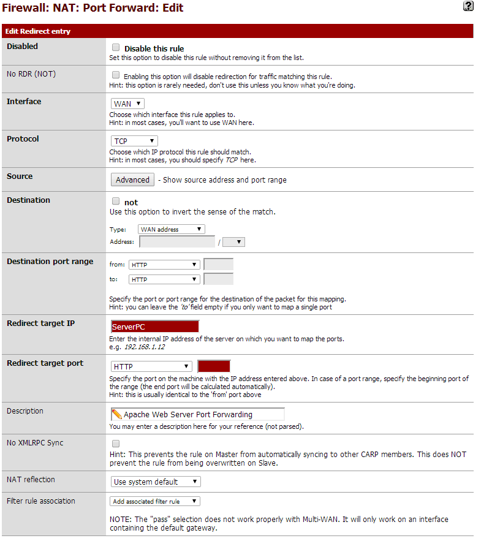
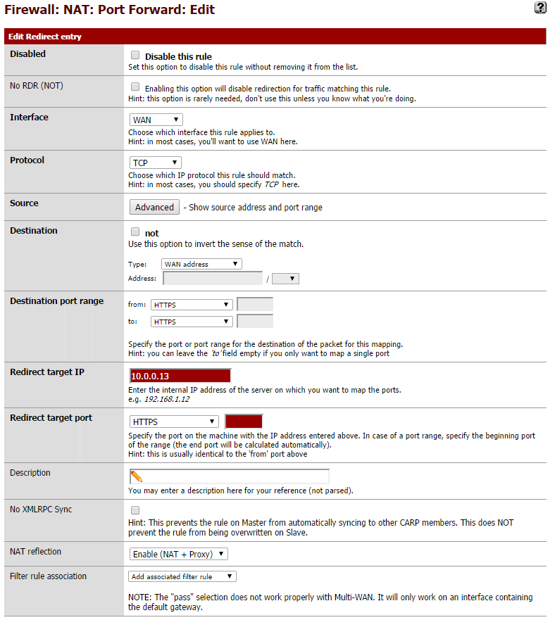

Web servers are configured to run on port 80 (HTTP) and 443 (HTTPS). pfSense, as a firewall, blocks all incoming connections to your network from the outside world.

<!-- more -->

By opening the 80 and 443 port we are allowing the outside world (Internet) to access applications running on these ports on a local machine - which are commonly web servers. This also allows you to access your personal home server from literally anywhere in the world with an Internet connection. Web browsers will by default access websites at port 80 when they are HTTP and port 443 when it is HTTPS e.g. https://calvin.me:443 and http://calvin.me:80 are the same as https://calvin.me and http://calvin.me. This guide will help port forward web servers in pfSense.

**1.** Under 'System -> Advanced', change the TCP port to anything but 80 or blank. If your website is using SSL (HTTPS) then do not use 443 like I have. If your web server does not use HTTPS use 443, if it does use 444 for pfSense from now on. This will change how you access pfSense from now onwards e.g. https://10.0.0.1:444.

Save and Apply this setting and wait for pfSense to redirect you or you can redirect yourself to the new web interface URL.

**2**. Once in the new URL, return to 'System -> Advanced' and check the '_WebGUI redirect_' option to prevent pfSense from redirecting your web server to itself. Save and Apply this setting.

**3.** While still in '_Advanced_', navigate to the '_Firewall/NAT_' tab and scroll down to '_Network Address Translation_'. Change the '_NAT Reflection_' mode for port forwards' to 'Enable'. Choose the option which suits you more. I found '_NAT + Proxy_' works for me but '_Pure NAT_' does not.

Choose (NAT + Proxy) Reflection mode.

**Optional Step:** On the top menu, click 'Firewall -> Aliases'. Here you can set an alias for a Machines, Ports and URLs, saving you having to change the IP address in a lot of different places if it does change. Create a new 'IP Alias' with the information of the web server. You can now just reference the Alias instead of the IP address.

**4.** Navigate to 'Firewall -> NAT' from the top menu bar. This is where you configure Port Forwarding, 1:1, Outbound and NPt. You want your port forward table to look like this (I used an IP instead of an Alias...bad Calvin). To do so, create a new 'port forwarding' rule.

**5.** Enter in the details of your web server. Any red input boxes are linked to aliases. You can select HTTP and HTTPS from the port dropdowns . If you are running server blocks on NGINX or Virtual Hosts on Apache, you will only need to port forward that one host.

_With an alias, HTTP Port (80)_:

_Without alias, HTTPS Port (443)_:

**6.** Save and Apply the changes.

Congratulations, you should be able to access your web server from the Internet!
