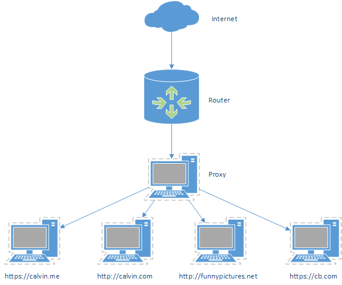

Running HTTPS on NGINX is easy. Running a web server with HTTPS on [NGINX server blocks](https://www.nginx.com/resources/wiki/start/topics/examples/server_blocks/) can also be easy. The only real problem is getting your settings correct on both the web servers and proxy servers and where your SSL certificate and keys reside.

<!-- more -->

_Example of server blocks on NGINX_:



**1.** Grab a SSL Certificate. I got mine from [StartSSL ](https://www.startssl.com/%20)for free. Supported in all the popular browsers.

Digital Ocean has good write-up on [obtaining a certificate through StartSSL](https://www.digitalocean.com/community/tutorials/how-to-set-up-apache-with-a-free-signed-ssl-certificate-on-a-vps). Come back here when it starts getting into 'Apache' as we're using NGINX.

Place your SSL files on the Reverse Proxy server under '/etc/nginx/ssl/'

**2.** On the Reverse Proxy Server (_proxy_ from now on), edit the configuration file for the remote host. I will be using _calvin.me_ as the example.

```shell-session
$ sudo nano /etc/nginx/sites-enabled/calvin.me
```

The original configuration file may look something like this:

```nginx
server {
     listen 80;
     server_name calvin.me www.calvin.me;

     location / {
          proxy_redirect off;
          proxy_set_header Host $host;
          proxy_set_header X-Real-IP $remote_addr;
          proxy_set_header X-Forwarded-For $proxy_add_x_forwarded_for;
          proxy_pass http://your_remote_host_ip_or_fqdn_here;
     }
}
```

Edit it so it looks like the one below. The new stuff is highlighted in red.

```nginx
# redirect calvin.me to https
server {
    listen      80;
    server_name calvin.me;
    return 301 https://calvin.me;
}

# redirect www prefix to https
server {
    listen      80;
    server_name www.calvin.me;
    return 301 https://www.calvin.me;
}

# listen on https port (443)
server {
    listen 443 ssl;
    ssl_certificate /etc/nginx/ssl/calvin.me.crt;
    ssl_certificate_key /etc/nginx/ssl/calvin.me.key;

    root /var/www/calvin.me/html;
    index index.html index.htm;
    server_name calvin.me www.calvin.me;

    location / {
            proxy_redirect    http:// https://;
            proxy_set_header  Host $host;
            proxy_set_header  X-Real-IP $remote_addr;
            proxy_set_header  X-Forwarded-For $proxy_add_x_forwarded_for;
            proxy_set_header  X-Forwarded-Proto https;
            proxy_pass        http://wp.calvin.me;<br>
    }
}
```

**3.** Save and restart the NGINX server when done.

```shell-session
$ sudo service nginx restart
```

**Optional.** If you are running WordPress you will have to add two lines into the _wp-config.php_ file (on the _WordPress host_, not the _proxy_)

```php
if (isset($_SERVER['HTTP_X_FORWARDED_PROTO']) && $_SERVER['HTTP_X_FORWARDED_PROTO'] == 'https')
  $_SERVER['HTTPS'] = 'on';
```

Remember to change your WordPress Address and Site Address URL to 'https' instead of 'http' under Settings > General

**4.** Head over to the HTTPS version of your site and test it out (remember to port forward 443 if you have to).
