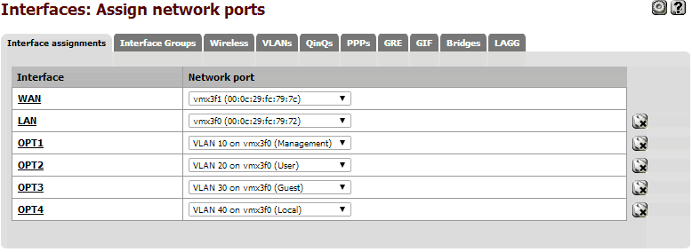
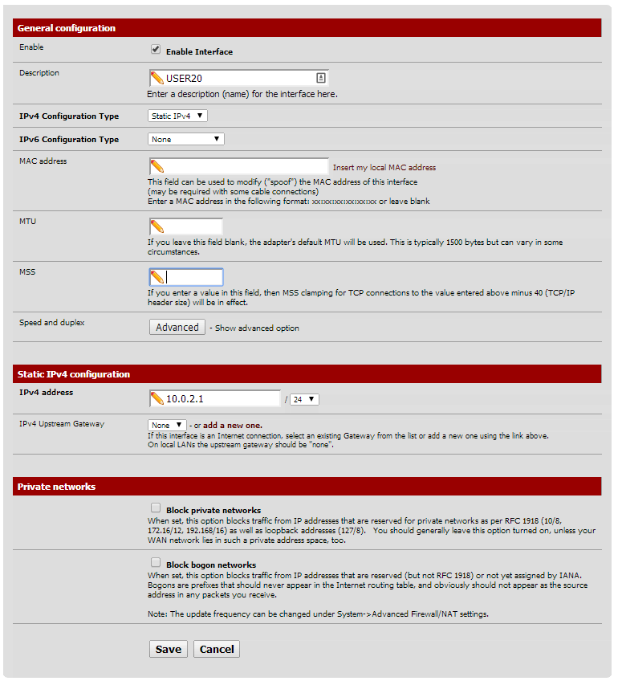
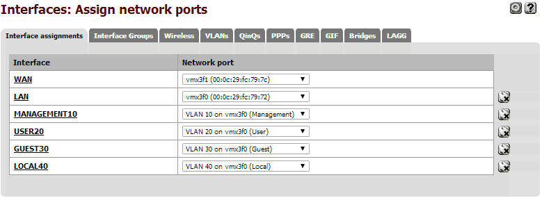
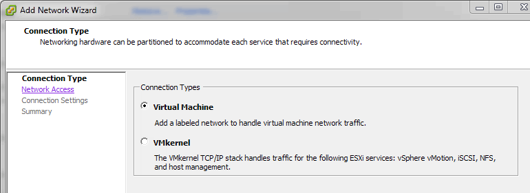
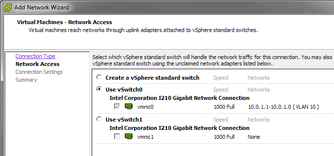
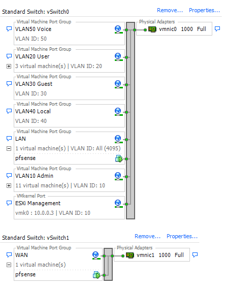
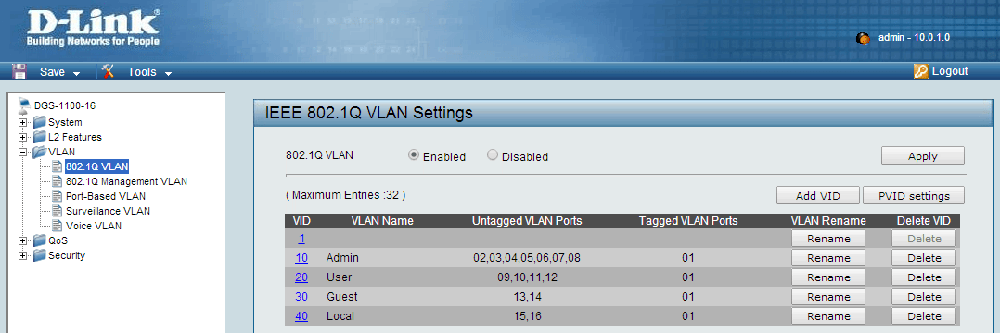

My current set-up has [pfSense vitualised](https://www.pfsense.org/) on an [all-in-one ESXi host](/all-in-one-esxi-server/) providing networking to my entire infrastructure. This infrastructure is both virtual and physical and therefore denying guest access to them is very important so that not anyone can just type an IP address into their browser and begin changing settings.

We can do this through the use of [VLANs](http://en.wikipedia.org/wiki/Virtual_LAN) to restrict users to one particular network while having Administrator access to all. pfSense has the ability to set up VLANs and deny access between them. In addition to this, our [managed/smart network switch](http://www.dlink.com.au/business-solutions/16-port-gigabit-easysmart-switch) and [VMware vSwitch](http://www.vmware.com/products/vsphere/features/distributed-switch) support this feature.

<!-- more -->

## VLAN Prerequisites

Have some VLAN numbers in mind. Something memorable if possible. Possible VLAN numbers ranged from 0 to 4095 but never use:

*   0 - user priority data
*   1 - native VLAN
*   4095 - automatically discarded

Here are the VLANs I chose for myself that were easy to remember and had a common separation of components.:

*   **Management VLAN 10**: For Administrative operations. Access to all other VLANs. Where the infrastructure and my main computers will be.
*   **User VLAN 20**: Gives access to file server and little bit of infrastructure like a printer and sound system. Mainly for trusted family and friends.
*   **Guest VLAN 30**: Internet Access only. No access to anything but the Internet.
*   **Local VLAN 40**: No Internet Access. Just a plain old local area network for whatever purpose.
*   **Voice VLAN 50**: VoIP devices go here. Traffic will be prioritised over other VLANs
*   **Surveillance VLAN 60**: When I get some cameras and surveillance cameras this will be there they go.

## Let's Begin to VLAN

**1.** Log into pfSense and go to 'Interfaces -> VLANs'.
Create a new VLAN using your LAN interface as the parent interface. I only have two NICs and the WAN NIC is certainly not going to be a VLAN.

Give your VLAN a number/tag (10) and a short description of what it is (e.g. Management).

Continuing creating VLANs to your heart's content until you have enough.

_Finished list_:

**2.** Go to 'Interfaces -> Assign' and add some new Interfaces for your new VLANs. We will worry about renaming and configuring them next.

_Assign Network Ports_:

**3.** Pick an interface under the 'Interfaces' menu and enable it. This will give you the ability to configure it.

Give the interface an IPv4 address (gateway). Make sure it is unique and outside the address range of your other networks/interfaces. I chose to give each VLAN a _10.0.X.0_ address, where X is the VLAN number.

*   LAN is 10.0.100.1/24 (will never be used)
*   VLAN 10 is 10.0.0.1/23 (covers 10.0.0.1 - 10.0.1.255)
*   VLAN 20 is 10.0.2.1/24
*   VLAN 30 is 10.0.3.1/24
*   VLAN 40 is 10.0.4.1/24

You can return to the Interfaces page to confirm your VLANs.

**4.** Enable any DHCP servers for the VLANs interfaces if you need it. I have configured half of each range to be DHCP and the other half to be static.

_Configure DHCP on any/all VLANs_:

**5.** Go to Firewall -> Rules and select a VLAN interface. Currently each VLAN cannot access anything, like ANYTHING at all without any 'pass' rules. Play with this until you are happy with it. I will share my rules in a future post.

**6.** Log into your VMware vSphere Client and go to 'Configuration > Networking' under your ESXi host.

First edit your LAN Port Group so it has access to All (4095) VLAN groups. Doing so allows pfSense to configure VLAN access to VMware. Imagine you are configuring a switch, except this one is virtual. Allowing the LAN 'port' on the switch to access all VLANs transforms it into a 'trunk' or 'tagged' VLAN port which is able to carry all VLAN data.

_LAN VLAN Access_:

**7.** Begin to create additional Port Groups for VLANs. Click 'Add Networking...' in the top right hand corner.

a. Choose 'Virtual Machine' as the connection type.

b. Select the same vSwitch as the LAN Port Group we edited earlier

c. Enter the Network Label and its associated VLAN ID.

d. Repeat for all other VLANs.

You can now assign Virtual Machines to different VLANs by changing their Network Connection/Network Label from LAN to your specified VLAN.

**8.** Now to activate VLAN access on your Switch from your virtualised pfSense. Log into your managed switch and browse to the 802.1Q or VLAN section.

Create a new VLAN matching your current VLAN settings.

Depending on your switch, you may have the terms '_Untagged_' and '_Tagged_' or '_Access_' and '_Trunk_'. Cisco brand switches will use '_Access_' and '_Trunk_' while other vendors stick to the '_Untagged_' and '_Tagged_' convention. To make it easier to remember:

*   Untagged = Access
*   Tagged = Trunk

_Untagged_ ports should be ports you wish to provide access to that particular VLAN.

_Tagged_ Ports are ports which provide Untagged ports with access to those VLANs. They are an uplink to your pfSense/ESXi box.

In my scenario, my ESXi box (which contains by pfSense virtual machine) are connected to port number 1 on my switch. This port is therefore capable of every single VLAN (All (4096) as we specified in VMware earlier). Ports 2 to 8 will now be assigned with VLAN 10 when they are passed from the switch to pfSense.

Configure all other VLAN ports as necessary.

If a DHCP is configured on each VLAN through pfSense, you should be able to acquire an IP address with matching DHCP range when you plug a device into that port.

Now that our virtual switch and physical switch have been configured for VLANs you can take a rest. If you want to go a few steps further, try separating VLAN access from one another in pfSense or try connecting wireless access points to your network, don't worry if you can't, I'll help out with that in the future :smile:
