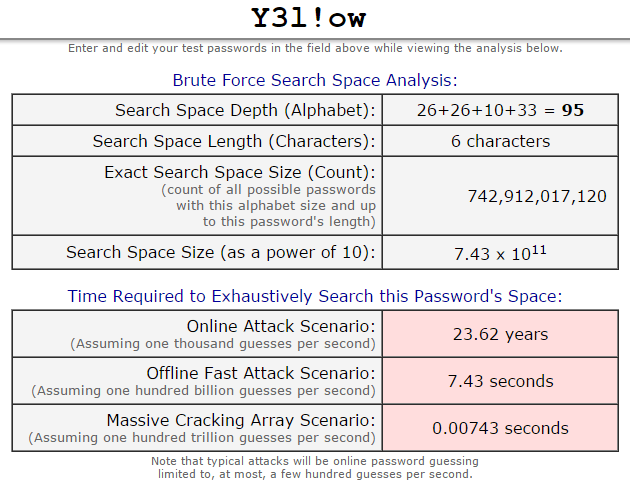
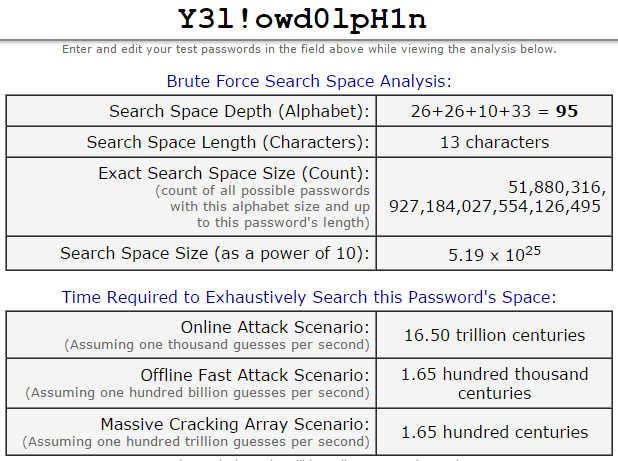
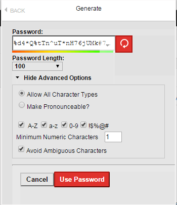
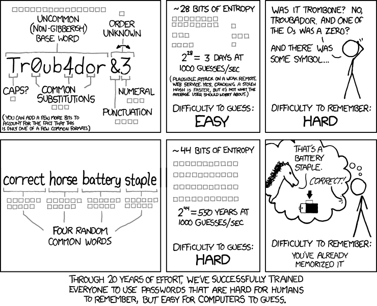

It's a common misconception that difficult passwords (e.g. X2hj2i) are strong passwords. It takes a computer 0.00743 seconds to crack that one...

_Through 20 years of effort, we've successfully trained everyone to use passwords that are hard for humans to remember, but easy for computers to guess. - xkcd [[http://xkcd.com/936/](http://xkcd.com/936/)]_

<!-- more -->

## How fast is fast?

Look at all the possible characters we can have on a typical keyboard:

```
abcdefghijklmnopqrstuvwxyzABCDEFGHIJKLMNOPQRSTUVWXYZ1234567890! @#$%^&*()-_=+[{]}|`~;:'",<.>/? 'spacebar'
```

That's **95** possible characters with 26 lowercase letters, 26 uppercase letters, 10 digits and 33 symbols.

If we were to calculate that statistically:

*   If your password was one letter long it would take **95** guesses.
*   If it was two letters long it would take **9025 **(95 x 95) guesses.
*   **857375** (95 x 95 x 95) for three letters.
*   **81450625** (95 x 95 x 95 x 95) for four and so on.

Those are big numbers that would probably take at least a whole year if you were to type every combination out. However we have computers.

According to [Gibson Research](https://www.grc.com/haystack.htm) a simple password such as 'Y3l!ow' (6 characters) could only take **0.00743 seconds** to crack even with **735091890625** possible combinations. In under a second, your savings account would be gone. This is known as a [brute force attack](http://hashcat.net/wiki/doku.php?id=mask_attack).

[](y3l01.png)

However by simply having a longer password length such as 'Y3l!owd0lpH1n!' (13 characters), it now takes **16500 years** to crack. Holy.

[](y3l01doplh1in.png)

The amount of guesses exponentially grows when more characters are added. So it doesn't really matter how good your password is unless it's really really long. But that's only the start.

## How so fast?

Hackers aren't stupid. They're probably a lot smarter than you and I (or at least media makes them out to be e.g. Felicity Smoak). They know that people like you and I have common patterns when formulating our passwords.

*   Passwords are more likely to start with an uppercase letter than a lowercase. This can be penetrated using a [mask attack](http://hashcat.net/wiki/doku.php?id=mask_attack).
*   Numbers are most likely appended onto the end. This is also a mask attack.
*   Most importantly: people use dictionary words or a combination of two or more. This can be penetrated using a [dictionary attack](http://hashcat.net/wiki/doku.php?id=dictionary_attack) or [combinator attack](http://hashcat.net/wiki/doku.php?id=combinator_attack).
*   People spell words backwards. This can be penetrated using a [permutation attack](http://hashcat.net/wiki/doku.php?id=permutation_attack).
*   All of the above put together

Tools such as [oclHastcat](http://hashcat.net/oclhashcat/) are able to target every single one of these common scenarios. But luckily our security teams aren't stupid either! There are safeguards is place.

*   One method to stop brute force attacks is to lockout attempts after a certain number of tries.
*   Some sites like to verify the location you're logging in and ensure it isn't a outlier such as China or Russia. Google does this and notifies you in your GMail if something's up.
*   Many sites use two-step verification by sending a message or code to your phone or other device.
*   Sites like to enforce strong password rules so that hackers must test all 95 characters instead of just lowercase letters

[](mjaxmy1myzezn2u0nzhlzwzmndu3.png)

## How do I make a strong password?
So how do you make a strong password? You slam random keys on your keyboard until its long enough and random enough. But then how will you remember it? To tell you the truth, I don't, my password manager does.

There are dozens of password managers out there like LastPass (what I use), KeePass, Dashlane and 1Password. They generate and remember passwords for you, you just have to remember one password to unlock the vault and you better make sure its a good one. Some store credentials on their own servers while others ensure you  have an encrypted file that you personally look after.

[](lastpass-generator.png)

Plugins and addons are available for popular browsers as well. They recognise login forms and can autofill them when necessary. Mobile applications for the various managers are also available either official or third-party.

## My definition of a strong password

Although subject to change (and criticism) my definition of a strong password is:

*   Contains uppercases but not only in the first position
*   Contains lowercases
*   Contains digits although not appended or prefixed
*   Contains symbols
*   Greater than 10 characters
*   No dictionary words
*   Minimum 12 characters (174 years to crack)
*   Not memorable, just plain random F&~;1XK{qs'r

[](password_strength.png)
