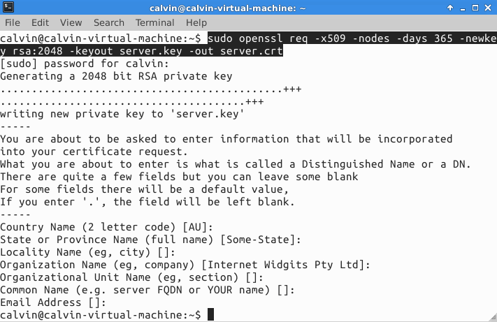
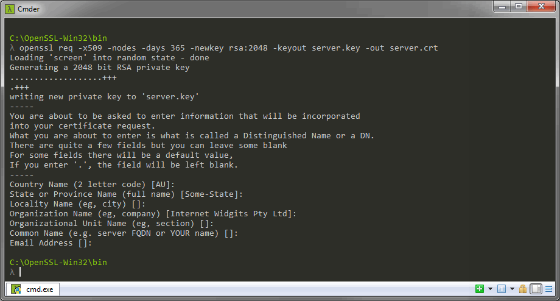
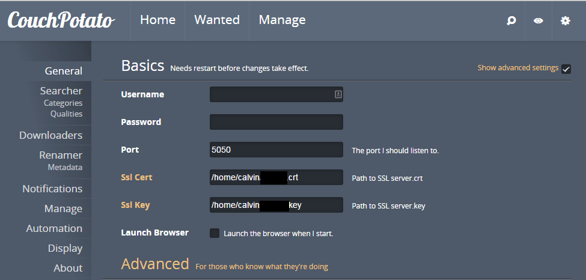

Why send data over plain text when you can encrypt it as well! SSL/TLS doesn't have to cost anything - it certainly doesn't cost me anything. Certificate Authorities supply 'trusted' certificates but we can generate our own 'untrusted' certificates, and well who doesn't trust themselves right?!

<!-- more -->

## Why?

While SSL on the Internet is important to verify the legitimacy and authenticity of websites and individuals behind them (mainly), it's main purpose is to encrypt data sent from you and the server (and vice-versa). For offline use, that's really all it's for - so no one can sniff the air and grab your passwords being sent over plain text!

## Generate a self-signed certificate

_**Word of warning**: older versions of OpenSSL are vulnerable to the [HeartBleed](http://heartbleed.com/) bug, comprising all your encryption! Make sure you get the latest version from the OpenSSL website or your Linux package manager._

It's so easy to generate a certificate. If you have OpenSSL installed on a Linux machine, just run:

```shell-session
$ sudo openssl req -x509 -nodes -days 365 -newkey rsa:2048 -keyout server.key -out server.crt
```



On Windows, you can download and install [OpenSSL from their website](https://www.openssl.org/). Browse to where openssl.exe has been installed (mine is at C:OpenSSL-Win32bin) and run the command:

```shell-session
$ openssl.exe req -x509 -nodes -days 365 -newkey rsa:2048 -keyout server.key -out server.crt
```

[](capture3.png)

Both these commands will generate a certificate and key file valid for 365 days (1 year) within the directory you ran the command. Increasing 365 to 3650 would make it valid for 10 years.

There are a variety of commands available to convert your .CRT and .KEY file into another encoding format. The .CRT and .KEY files are definitely the most popular option but I've had situations where a .PVK or .PEM file was needed (Sonarr I'm looking at you!). SSLShopper has a [guide for these commands](https://www.sslshopper.com/article-most-common-openssl-commands.html).

## Encrypt Everything. EVERYTHING.

With a (unsigned) certificate in one hand and a key in the other (sorry people with no hands), you can now encrypt everything you want...as long as it supports it. Sure sure you should generate new certificates for every new thing but does it really matter if its only going to be private? The fact that data will be encrypted is well, good enough for a home network.

Once the certificate is ready, locked, and loaded...it's time to deploy.

Here is an example of how you can deploy SSL to encrypt the front-end of several applications:

_SabNZBD_:


_Headphones_:


_CouchPotato_:



It is also possible to use SSL to encrypt a back-end connection to a database, LDAP server, web server, etc. This is a bit harder to show in pictures but usually all you have to do is let the application know to use SSL when making a connection.

_NGINX SSL Configuration_:


_MediaWiki LDAPS connection_:


_GitLab LDAPS connection_:


## I've encrypted everything. I'm safe now...but from what?

SSL/TLS prevents [man-in-the-middle attacks](http://en.wikipedia.org/wiki/Man-in-the-middle_attack) and [replay attacks](http://en.wikipedia.org/wiki/Replay_attack) that sniff out sensitive information sent and received on a network. What it does more or less is confirm the identity of the party sending and receiving information, and it that changes at any point the connection will fail.

SSL/TLS is not 100% secure though, servers can still be attacked directly or user error (phishing, installing malware etc.). It does very little to prevent being hacked. It's only responsible for protecting communications between hosts.

Better than having nothing right?
