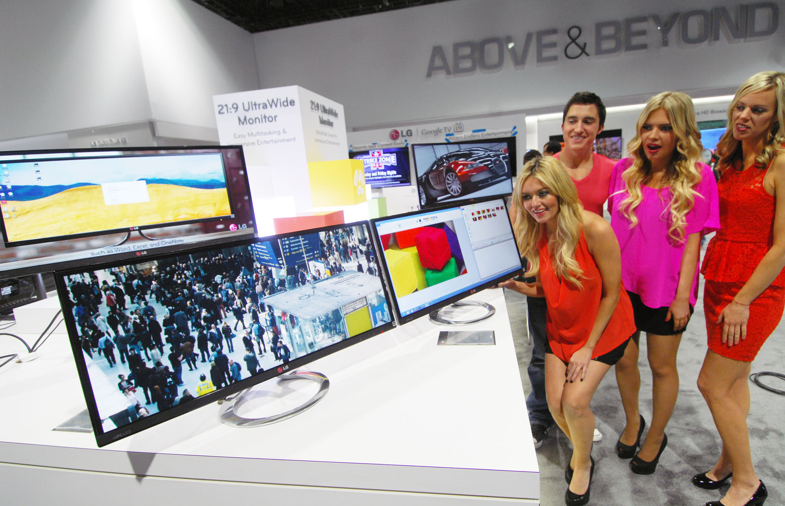
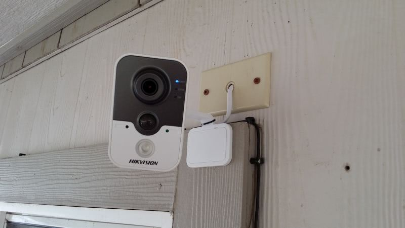

Now that 2014 is almost over and its time to wrap up the year, there are a few plans I have in mind for the year ahead. Now they might be ideas and plans I've had for 2014 that I never got around to but some are goals that I would've had to wait until the technology matured a lot more.

<!-- more -->

## 

## Server and PC Upgrades

This year I built my first 'real' server (not some HP microserver shit) and infrastructure and started this blog to write about it. It wasn't perfect, it was a bit hacky in ways (how I do things) but I definitely love how it has turned out so far. I don't plan on switching over to server racks and 2U cases anytime soon but there are a few upgrades planned to increase my knowledge and experience.

#### Another ESXi host

One thing I really need in my server right now is more memory. Intel still restricts LGA1150 boards and CPUs to 32GB whereas LGA2014, i7 Extreme and E5/E7 chips are able to have 64GB and more to 512GB+. Upgrading my entire chipset would require a new motherboard, CPU and probably case (yeah nah) but adding another host would ease the burden through clustering.

I plan to get my HP N40L Microserver as another ESXi host. It's doesn't have a very good CPU, ethernet card or anything really but it can sure do more than what I'd want it to at the moment.

#### Upgrade the main PC

The GTX 680 is getting a bit old so any upgrade would be pretty good at the moment. I wonder if the new series will be called GTX 1190? Sounds stupid. I could do with a ultra-wide monitor as well to sit in the middle of my two 27 inch Dells.

I'm quite interested in new cases appearing on HardForum's Small Form Factor section from time to time such as [A4](http://hardforum.com/showthread.php?t=1799326).

#### Networking

Link Aggregation and 10Gb networking are two things I'm very interested in. The reality is that I'll probably be only be able to achieve link aggregation. pfSense offers 'LAGG', their version of LACP that I can benefit from to increase bandwidth on my network. Four upstream ports mmm mmm mmm.Getting a network card would be the first step!

## Gadgets

#### Surveillance Cameras

I have a VLAN for surveillance cameras set up but I still haven't gotten around to looking at buying any. I'm looking out for a camera which I can remotely view from, good night mode and supported by a variety of apps on both desktops and mobiles.

Zoneminder is a Linux application which handles video cameras that I'm looking at. Coupled with that, I plan to get either some cheap D-Link cameras, Hikvision or Dahua. I'm looking at the Hikvision DS-2CD2412F-I at the moment.

#### Get a Chromecast, Roku, WD Live or any other streaming device.

I'm not sure how much I need one but there have been times when It would've came in handy. But If I get one of these I'd probably need a massive TV to go with it :smile: Putting a pin in this for now.

## Learning

#### Get into Vagrant, Salt, Ansible, Docker, Chef, Puppet, Packer, etc. etc. something

All these things people always talk about! I've got to give them all a try to get a step above the rest. I have a good idea of what each does (automation, containers, vm creation) but not how they actually all do it. What really interests me is the ability to manage all my VMs from something like Puppet or Chef similar to what Ubuntu's Landscape or Red Hat's Spacewalk would provide.

#### Get a certification in anything

Something I've always wanted to do. Every few months there are free Microsoft exams available on OzBargain as well. I'll probably aim for a Microsoft Certification first, then maybe a VMware or Cisco certification if I feel like a challenge. Doing what you don't want to do leads to success!
