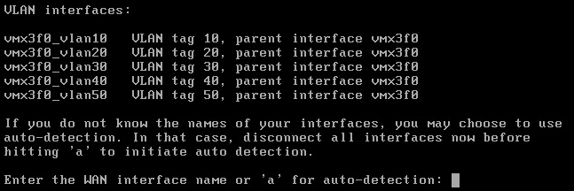
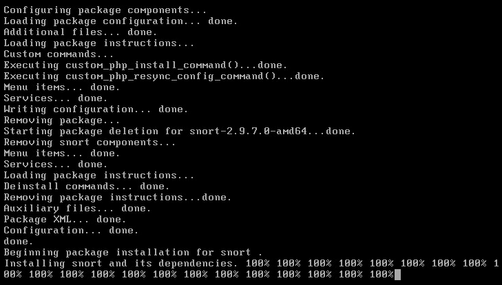
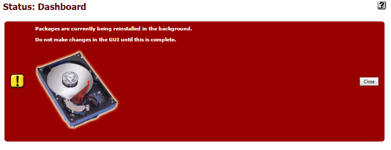
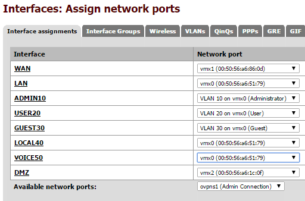
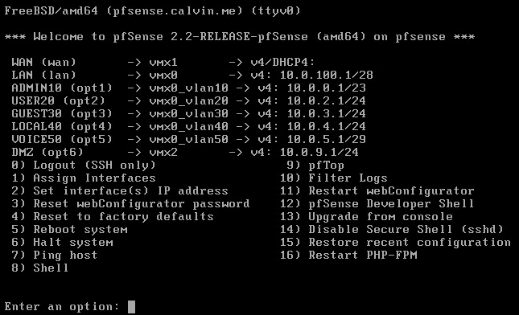

pfSense 2.2 has been released! This release brings FreeBSD 10.1 but also fixes over 300 bugs as well. The biggest change for those virtualising on VMware will be the VMXNET3 label change from 'vmx3f' to 'vmx'.

<!-- more -->

## pfSense 2.2 Changes

All the pfSense 2.2 changes can be viewed [here](https://doc.pfsense.org/index.php/2.2_New_Features_and_Changes).

The change which I believe caused the NICs to change their names is the update in OS base to FreeBSD 10.1. In FreeBSD 9 (pfSense 2.1.X), the VMXNET3 NICs are labelled as 'vmx3f' whereas FreeBSD 10 uses 'vmx'.

## Who and what is affected

Those that use VLANs will be the most affected. VLANs are bound to a parent interface (generally your LAN or vmx3f0). When your parent interface no longer exists, the VLAN stops to work.

The second group of users to be affected are those who use packages that bind to specific interfaces. This varies depending on the package but I have had vnstat2 still reporting on vmx3f interfaces even after reinstallation.

## How to safely upgrade

Assuming you are on VMware (as per the blog title), the first best thing to do is perform a snapshot/backup within vCenter/vSphere.

1.  Perform the update to 2.2. This is under System > Firmware.
2.  After the system updates and restarts, head over to the VM's console to reassign the interfaces. 

	

3.  When asked about VLANs, answer 'no' to be given a list of your current VLANs and their interfaces. 

	

4.  Similar to your first-time setup, enter the matching interfaces for the WAN and LAN (vmx0 and vmx1 I would assume).
5.  When asked about your VLANs, enter the old interface such as vmx3f0_vlan10 (do not enter vmx0_vlan10) as shown earlier.
6.  Enter all interfaces including any optional interfaces you may have (e.g. vmx2, vmx3 etc.).
7.  When you have entered all the interfaces, pfSense will connect to the Internet and upgrade any packages it can find such as snort and squid.

	

	

8.  Once finished pfSense will return to its usual console menu.
9.  Get a LAN connection. If you are on a VLAN this will not work, you require a LAN connection to reestablish a connection to pfSense.
10. Log into the pfSense web configurator and change your VLAN parent interfaces to the new vmx interface.

	

11. Apply the new interface assignments and restart pfSense.

	

12. Your interfaces should now be back in order and working again. 

	

## Other Changes and Fixes

These are mainly due to the upgrade to 2.2 (which hasn't gone smoothly for a lot of people including myself) or the change of interfaces not changing package settings.

### vnstat2

There are two problems with vnstat, it does not have a database and it still lists the old interfaces.

To create the database, run these two commands:

```shell-session
$ mkdir -p /var/lib/vnstat
$ /usr/local/bin/vnstat -u -i vmx0 # replace vmx0 with your preferred interface
```

To fix the issue with the old interfaces, edit the file /usr/local/www/vnstat2/config.php where it holds the list of interfaces.

```shell-session
$ vi /usr/local/www/vnstat2/config.php
```

You will need to change the following line to match your new interfaces:

```shell-session
$ iface_list = array('vmx3f0', 'vmx3f0_vlan10', 'vmx3f0_vlan20', 'vmx3f0_vlan30', 'vmx3f0_vlan40', 'vmx3f0_vlan50', 'vmx3f1', 'vmx3f2');
# delete 3f in every interface to get vmx0_XXXXX instead of vmx3f0_XXXXX
```

### HAVP and Squid

HAVP and Squid are both updated in version 2.2. The downside is that HAVP no longer works for me and Squid decided to go from version 2 to 3 without asking.

Squid 3 provides c-icap antivirus built in along with clamd, a replacement for HAVP but not as nice. The downside is you won't get to use templates/web pages to notify users of viruses as easy as HAVP did.


### Snort

Because of the new interface, Snort changes where it stores its logs and therefore the Snort tab will be empty. You can verify this by going to /var/log/snort where you will find a folder starting with 'vmx' and another with 'vmx3f'.


