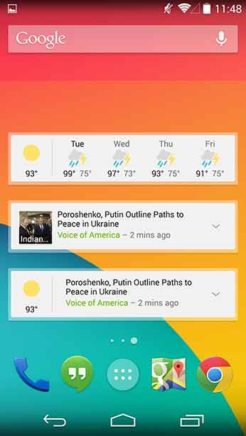
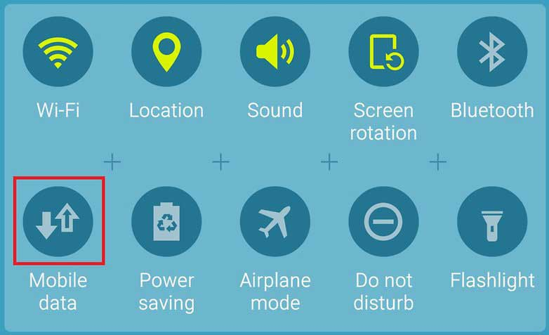

I had a few days with an iPhone so I decided to try it out and see if it was usable for someone like me.

<!-- more -->

My Dad got me to buy my cousin an iPhone 6 (Silver 64GB as he insisted) as a graduation present. She's a nurse now, good on her. I haven't seen her in over 10 years as she lives overseas but she was always clever and had charisma. Moving on though...

## What's In The Box?

All these smartphone and tablet boxes are real hard to open. Separating the two parts of the box in its clamshell lock can be challenging. A little wiggle and tugging eventually separates it apart. Of course every unboxing video I watch has a [perfectly smooth glide](https://youtu.be/BhaUCHGDJkk?t=13s). I have never been able to do that, even as part of my job where I've opened over 100 brand new iPads.

Inside is everything as standard:

*   iPhone
*   Lightning to USB cable
*   EarPods earphones
*   USB charger

But all this stuff is rudimentary...let's move on again.

## What am I using?

I am not a power user but I do use every single feature of my phone. In a regular day, I :

*   make phone calls
*   send text messages
*   send WhatsApp messages
*   check Snapchat and Facebook
*   navigate using the GPS
*   watch videos online or locally
*   listen to music
*   check my bank accounts
*   take photos
*   schedule and read my calendar
*   take notes and reminders
*   basically everything

My key concern for a phone is therefore its features and battery life to achieve all the above in a day.

## What Did I Like and Dislike?

#### LIKED: Fingerprint Reader

iOS is far ahead in this category, the fingerprint reader is integrated very well in a lot of places where I'd be entering my password instead. Unlocking the phone is effortless and very safe that its just the greatest convenience I've had with the iPhone. The downside though is it only stores five fingerprints. I'd like to see this increase as I don't always use my thumbs and index finger to unlock the phone especially when I'm trying to reach it from a distance using my middle fingers.

Google is playing catch-up with the Fingerprint API in Android M and I will be excited to see its uses.

#### LIKED: Animations

It was oddly satisfying seeing the display zoom in and out of applications. It's great to know where I'm going in and where I just came out of instead of being thrown screen to screen by random animations.

#### LIKED: AirDrop/AirPlay

It's good to see a feature like this built into phones. AirDrop made sending photos I took much easier than bluetooth/email/MMS etc. It was quick as well, sending over a congested Wi-Fi network with over 300 devices. AirPlay on the other hand was similarly smooth and responsive when mirroring my screen and sending audio for a small consultation I did over the same network. It would be great for there to be an standard for wireless transfers. Bluetooth is good but requires pairing and NFC requires being next to the person you're sending it too. A really good feature that even works with Mac OS X.

#### DISLIKED: Managing Music

Can. This. Be. Any. Harder.

Putting music on this phone is impossible without iTunes. I don't want to use iTunes. Please don't make me use iTunes!

The best solution I found was using apps that could connect to my network shares and copy music to the app's own storage. The downside of this was my music wouldn't appear in any music player. I could still play it but without the ability to sort by album/year/title etc. They were literally just folders and files spread around.

Secondly, I do not want a random U2 album on my phone. [That took a while to even figure out how to delete](https://support.apple.com/en-au/HT201396).

Ultimately the only other way is to purchase music from iTunes. Well...I don't use iTunes so...

#### DISLIKED: Notifications

Notifications just don't appear on the top status bar like it does on Android. The only way I know I have something to get to is to either scroll around looking for a red number on top of an app or pull down the notification shade. Notifications do appear on my lockscreen but even then I'm skipping that completely using the fingerprint reader. It's really important for me to stay on top of things and this doesn't help at all.

#### DISLIKED: No Widgets

I guess this is more of a design thing for iOS. Widgets are possible through the 'Today' tab when you pull down the notification shade, but are very limited. I have widgets on my Nexus for my calendar events, credit usage and tasks. None of this was at all possible on iOS.

_A lot of dynamic information can be displayed with widgets._:

#### DISLIKED: Siri follow up questions

Siri's voice recognition was painful. I like to use voice commands a lot especially on the go when I don't want to be looking down typing in case I walk into something. Simple commands like 'navigate to william **stimson** public school' ends up becoming 'i don't know what william **stinson** public school is'. ARGH! One letter difference in the voice recognition and it couldn't locate the school.

One time it showed me a potential match it thought was the one so I replied with 'yes', but it turns out Siri doesn't accept follow-up answers/questions as of yet like Google Now does and instead did a search on the word 'yes'...

#### DISLIKED: No mobile data toggle

It was nice to see Apple include toggles for Wi-Fi, Bluetooth and Auto-Rotate in the Action Center menu that can be pulled up from the bottom of the screen. The bad news though is that it's missing the important mobile data toggle! I don't get why this wasn't editable or there was an easy way to turn off 3G on the phone. I'm on a data plan (1.5GB per month) and I prefer to not go through screens of settings to flip a single switch! I thought this was totally ridiculous.

_It's all I want!_:

#### DISLIKED: Convoluted Settings

I always thought Android's settings menu was a bit confusing, then I saw Apple's one. Is it me, or is almost everything I try and find turns out to be dumped under the 'General' tab? Trying to find keyboard settings? General. Trying to find battery usage? General. Trying to find storage usage? General.

#### DISLIKED: No Data Usage Limit

As mentioned before, my data plan is only 1.5GB per month. There hasn't been a single month where I've gone over this thanks to warnings notifications and data limits I can define through my Nexus' settings.

## I didn't like that much

I came into this experiment with an open-minded approach and compared it to my general usage with my Nexus 4 wherever possible. There were so many limitations to what it could do that I don't think I could use it as my daily phone. Everyone talks about the simplicity of an iPhone, but I believe they just don't know what it can do or things they're missing out on. But whatever the iPhone keeps simple like accessibility, no app drawers and simple controls, it does well. Without much else however, it's really a shadow of what Android has become.
