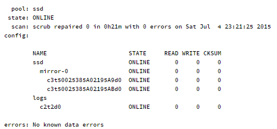

A short post on how I exponentially sped up my VMware environment.

<!-- more -->

Even with 20-30 or so VMs, I always found that they were always unresponsive or slow to do very standard things like logging in, listing directories, reading files.

#### Slow Performance Factors

I knew it was down to four main factors: CPU, memory, network or storage.

* It definitely wasn't the CPU as vSphere showed only 25% usage.
* It might be the memory since I'm a bit cheap and allocate 256MB or 512MB
* I don't think it's the network since I'm teaming four connections together for 4 gigabits/s
* I wouldn't assume it to be the storage since I'm mirroring two Samsung 840 Pro SSDs together

#### The Reason

Cutting to the point, after playing around with it all I realised that the storage was the limiting factor.

A few searches on the net led me to find that the reason for slow performance was the fact that **VMware ALWAYS writes to the NFS datastore using FSYNC** meaning that it's gotta wait for an acknowledge before any data is written.

#### The Solution: ZIL

The solution to increasing the speed of FSYNC is to add a ZFS Intent Log or ZIL drive. This requires a fast disk such as an SSD or battery-backed NVRAM. The simple explanation of how a ZIL works is that it takes any writes to the zpool and hold them until it is free to flush them over.

The downside of using this is that if the log device is lost, it is possible to lose the latest writes which could result in the loss of the entire zpool. This is hence why it is recommended to use a battery-backed device which can store these writes until the next time the zpool is powered on to flush over the data.

I ended up using an old Intel 60GB SSD (thick provisioned through VMware) onto my Samsung 840 Pro mirror.

#### Performance

A simple test I do is just performing an apt-update and dist-upgrade on VMs I haven't touched in a while

* Without ZIL: 25 minutes
* With ZIL: 1 minute!!!!

It was an amazing speed boost. I was amazed how fast everything is right now and why I didn't do this sooner.
