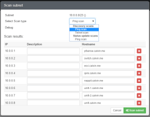
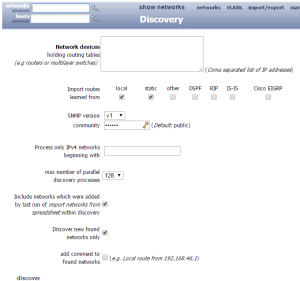

Lose the spreadsheets, manage IP addresses properly using an IP Address Management tool (IPAM)!

<!-- more -->

I'm one of those people guilty of using Excel to manage my IP addresses. It's not the most elegant solution but it worked and other people easily understand it...when its up to date. I never took the time to use it as I just kept my DNS records up to date and followed that instead. DNS records however are not an IP address management solution, since they can change but hosts are still set statically to that address. This is where an IP Address Management tool or IPAM is handy as it shows free IP addresses and pings the entire subnet to find stray ones.

Of course this is something I would never pay for (and the commercial ones cost too much anyway) so I grabbed a bunch of free ones to compare.

Based on some [initial research](https://www.reddit.com/) and [Wikipedia](https://en.wikipedia.org/wiki/IP_address_management), the three IPAMs that stood out where InfoBlox, phpIPAM and GestioIP.

### InfoBlox IPAM Express

[Download](https://www.infoblox.com/downloads/software/ip-address-management-freeware)

* Comes as a VMware Workstation Appliance, easily converted to ESXi. Do not change any settings as it needs the Flexible NIC to work properly.
* Very slow, might have to do with Java
* IP Address scans don't even show host names o.O
* Interface is very enterprise-y, custom everything.
* Interface is not mobile optimised
* Seemed more trouble than it was so didn't continue using it after 5 minutes

### phpIPAM

[Download](http://phpipam.net/documents/download-phpipam/)

* [Installation](http://frankhinek.com/how-to-setup-phpipam-on-ubuntu-14-04/) requires knowledge of Apache and its Virtual Hosts/Rewrite module
* Username/Password isn't very clear and locked me out for 5 minutes. Default username is Admin
* Uses MySQL, Apache 2 and of course, PHP
* Interface is very modern (running Bootstrap) and works well on mobiles
* Scanning is very easy, pings/telnet the entire subnet
* Pings devices to see if they are online
* Very pleasant to use and easy to understand

### GestioIP

[Download](http://sourceforge.net/projects/gestioip/)

* A lot of manual input required during installation
* Uses MySQL, Apache 2 and PERL
* Only supports .xls spreadsheets
* No mobile interface, very lacking in general
* Overall not pleasant and easy to use so I didn't go any further with it

--------------------------------

## Winner: phpIPAM

phpIPAM was so much easier and cleaner to use than the alternatives. There are probably better programs out there but at the moment it meets my needs quite well. The goal of having one is to reduce human error and use something higher tech than what is involved in Excel spreadsheets.

If you're using Microsoft Server 2012 (R2) as your DNS and DHCP than I recommend using the built-in IPAM feature which is free!
