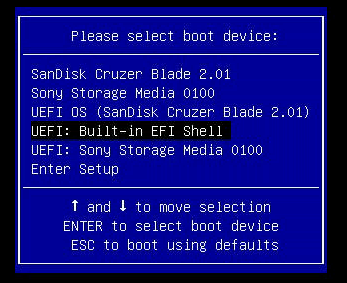
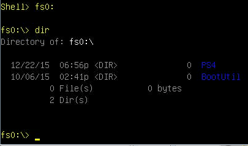
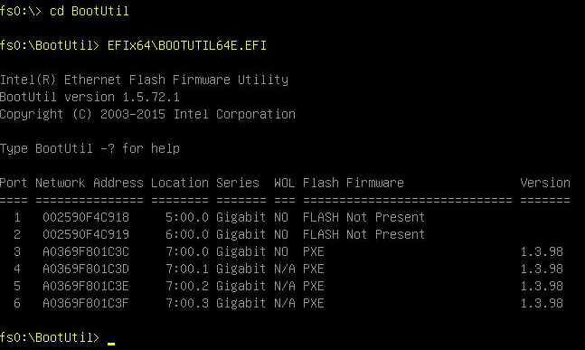
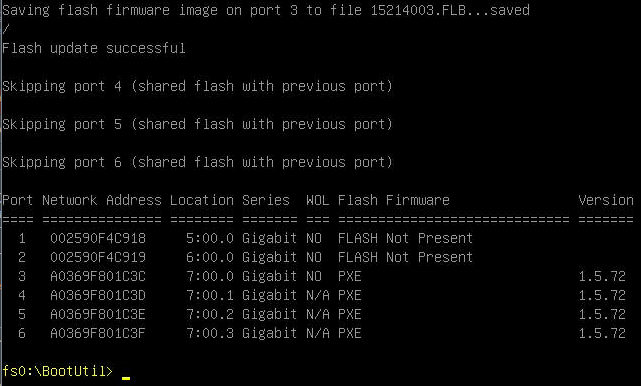

You should update your NIC cause newer is always better right? Right!

<!-- more -->

I honestly haven't found any good guides to run through this process so I thought I'd write my own.

I will be updating my Intel I350 T4 NIC that I got in Christmas 2014. I will be focused on updating through EFI rather than Windows or DOS. But the instructions should apply to both.

**1** Download the latest firmware from [Intel](https://downloadcenter.intel.com/download/19186/Intel-Ethernet-Connections-Boot-Utility-Preboot-images-and-EFI-Drivers). At the time of writing it was 20.4.1

**2** Run **PREBOOT.EXE** to unpack its files. You will need the _BootUtil_ folder under _APPS_

**3** Boot into your EFI, Windows or DOS

[](boot.png)

**4** For EFI, change paths by entering the path into the EFI shell. I am using a USB and it was mounted under fs0.

[](fs0.png)

**5** Depending on where you are updating once again, run the executable under your operating system folder to be shown a list of network adapters available

[](running-command.png)

**6** If a NIC is saying it cannot be flashed (but you know it can be), enable flash using the command:

```shell-session
$ BootUtil -NIC=1 -FLASHENABLE
```

Where -NIC is the port number. Reboot when done and go to the next step.

**7** You can choose to update a particular NIC or all at once using:

```shell-session
$ BootUtil -UP=PXE -ALL (Assumes input file is bootimg.flb)
```

Or specifying the file using:

```shell-session
$ Bootutil -UP=PXE -ALL -FILE=BOOTIMG.FLB (explicit user specified file)
```

**8** You will be prompted to save create a restore image for your NIC before updating. It is probably best to do this in case something goes wrong :P

[](updating.png)

**9** After the update, reboot and you are done!

[](update-complete.png)

## Conclusion

Did I notice a speed/latency difference? Nope :P

If you look at the release notes for each version, there doesn't appear to be any improvements, if at all, for any devices. Intel is just adding more support for their newer devices and operating system support for others.
