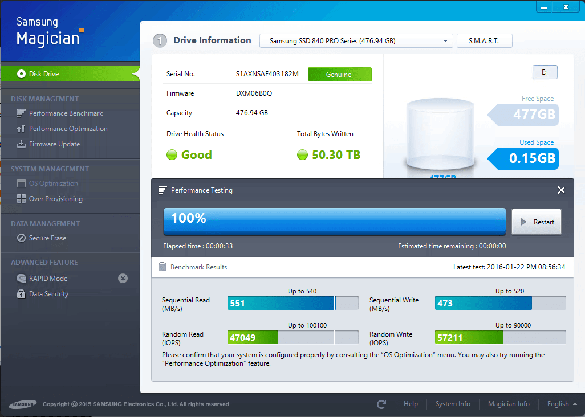

Taking a look back how my SLOG device has been performing on my ZFS pool after fixing some significant problems.

<!-- more -->

A few moons ago [I recommended a SLOG/ZIL to improve NFS performance on ESXi](https://calvin.me/slow-vmware-nfs-zfs-add-zil/). At the time I was experiencing tremendously slow write speeds over NFS and adding a SLOG definitely fixed that but only covered up the real issue.

## The Problem

I had really crap write speeds on my SSD pool. It was a mystery why as they were Samsung 840 512GB Pros.

```text
Memory size: 16384 Megabytes

write 12.8 GB via dd, please wait...
time dd if=/dev/zero of=/ssd/dd.tst bs=2048000 count=6250


real     2:08.5
user        0.0
sys         1.5

12.8 GB in 128.5s = 99.61 MB/s Write
```

My 6x4TB WD SE drives were performing smoothly however which made me believe it was really just a NFS issue on ESXi.

```text
Memory size: 16384 Megabytes

write 12.8 GB via dd, please wait...
time dd if=/dev/zero of=/hdd/dd.tst bs=2048000 count=6250

6250+0 records in
6250+0 records out
12800000000 bytes transferred in 25.665755 secs (498719016 bytes/sec)

real       25.6
user        0.0
sys         3.1

12.8 GB in 25.6s = 500.00 MB/s Write
```

## The (Temporary) Solution: Add a SLOG

As I wrote in my earlier post, I added a ZIL to my pool and it fixed everything. Write speeds were back up on ESXi and life was good. Deep down though, I knew something was still amiss.

What I did not know until now was how the ZIL was fixing the issues. The way a ZIL works is that it when ESXi writes to the zpool datastore, it is actually writing to the ZIL. The ZIL would then flush what it has onto the zpool when it gets a good chance. This 'middle-man' in a way was what temporary solved the issue as it would not affect the performance I saw. Behind the scenes however the ZIL would have been waiting a low time to write to the zpool due to the crippling write speeds.

## Testing and how I came to the solution

I tried a new installation of napp-it as recommended by its creator Gea. This showed no difference. [He then advised](http://hardforum.com/showpost.php?p=1042097373&postcount=7354) to disable sync and see if I was still seeing any difference. Nope no difference, actually it's even _SLOWER_ than before.

```text
Memory size: 16384 Megabytes

write 4.096 GB via dd, please wait...
time dd if=/dev/zero of=/ssd-Bd0/dd.tst bs=4096000 count=1000

1000+0 records in
1000+0 records out
4096000000 bytes transferred in 113.319963 secs (36145441 bytes/sec)

real     1:53.3
user        0.0
sys         0.8

4.096 GB in 113.3s = 36.15 MB/s Write
```

Leaving napp-it and OmniOS behind I decided to run tests on Windows 2012 R2 using CrystalDiskMark and Samsung's very own Magician Tool and I was not surprised that I was getting good results.




This made me believe there was something wrong with napp-it or OmniOS in general. I told Gea this info and he said it could be a [problem with the disks, HBA/firmware or the mpt_sas driver](http://hardforum.com/showpost.php?p=1042098980&postcount=7363) from OmniOS.

## The Solution

Temporarily leaving napp-it behind I decided to try out FreeNAS and see if the issues still arose. A quick dd benchmark and test were very good, but not the 500MB/s I was seeing on Windows.

```shell-session
[root@freenas] /mnt/ssd/dataset# dd if=/dev/zero of=/mnt/ssd/dataset/dd.testfile bs=4M count=10000
10000+0 records in
10000+0 records out
41943040000 bytes transferred in 10.980550 secs (3819757645 bytes/sec)
```

Something was still wrong. I messed around in FreeNAS for a while (I would say napp-it has a lot more features but FreeNAS is cleaner, but i digress) and noticed some alerts in the top right hand corner. It told me I needed update my LSI 2308 controller from P19 to P20 (which FreeNAS supported). This was pretty much the same advice Gea had told me so I gave it a try and...BOOM

```text
Memory size: 16384 Megabytes
write 12.8 GB via dd, please wait...
time dd if=/dev/zero of=/ssd/dd.tst bs=2048000 count=6250
6250+0 records in
6250+0 records out
12800000000 bytes transferred in 23.141027 secs (553130172 bytes/sec)
12.8 GB in 23.1s = 554.11 MB/s Write
```

The issue was fixed. 550MB/s write under dd benchmark.

## Retesting and Results

Now that my write speeds were back to normal I then pondered on the need of a SLOG device anymore. So of course I ran some test.

Here are the two tests I ran over NFS, ESXi does sync-writes so a SLOG is measurable here than using iSCSI.

### Ubuntu 14.04.3 LTS Server Installation

(But it uses the Internet to download during the Installation so not very accurate)

*   With SLOG: 5:31 minutes
*   Without SLOG: 9:18 minutes

### Windows 10 Enterprise LTSB Installation

(as soon as it begins writing to the disk)

*   With SLOG: 4:20 minutes
*   Without SLOG: 5:28 minutes

The time difference was very large on Ubuntu however I could not pinpoint it down write speeds due to the installation requiring components to be downloaded over the Internet. Windows 10 however saw only a ~1 minute difference which is no big concern.

## Conclusion: No SLOG/ZIL required

I removed my SLOG from all my zpools and called it a day. The risk of running a SLOG outweighed the performance it brought along. As soon as the SLOG failed I knew I would have been in for it. Running a SLOG mirror on the other-hand is a viable option if money is not a issue. For a good SLOG, recommendations usually included the Intel S3700 ($300 new) or ZuesRAM drives ($1000+), neither of which were very affordable.

Finding issues like these and fixing them are enjoyable especially when they are deeply layered and can change the performance of an entire system. Now if only I could solve all my Wi-Fi problems...
