When your drive dies, or in my case, the SATA port fails completely, this is a good temporary solution until the replacement arrives.

<!-- more -->

Live USB/CDs are a great way to try out new Linux distros or run things securely. They're also great when you don't have any other operating system to run or hard drive to install to. The problem with Live USB/CDs is that anything you do in them are erased as soon as you turn the computer off as it's all stored temporarily. The way around this is to create a persistent file storage system on-top of the Live USB which captures all files and folder changes. So now when you turn off your computer, everything you've done will be saved!

#### Note to pre-16.04 distros

This used to be a very simple process in Ubuntu before 16.04 using the Startup Disk Creator program. If you have 15.10, 15.04, 14.10, etc. on hand without any Internet, this is the best and easy temporary solution. Persistence was removed in 16.04:

```text
usb-creator (0.3.0) xenial; urgency=medium
[ Marc Deslauriers ]
* Rework the whole imaging process for writing to devices:
  - Use an equivalent of dd to make an exact copy of the image to the device
  - This also breaks persistence.

[ Mathieu Trudel-Lapierre ]
* Update UI and frontend code to drop the persistence widgets.
* Drop Erase Disk widgets too.

-- Mathieu Trudel-Lapierre <mathieu-tl@ubuntu.com>  Fri, 11 Dec 2015 12:37:41 -0500
```



## Let's start:

### Download Ubuntu

The first you want to do is boot up an existing 16.04 or later Live CD or installation. There are a zillion guides how to get this up and running but usually you'll need another computer first if you got a dead hard drive.

You can download [Ubuntu from here](http://www.ubuntu.com/download).

### Install the mkusb tool

Open up terminal and run the following commands:

If you run standard Ubuntu, you need an extra instruction to get the repository Universe. (Kubuntu, Lubuntu ... Xubuntu have the repository Universe activated automatically.)

```terminal
$ sudo add-apt-repository universe  # only for standard Ubuntu

$ sudo add-apt-repository ppa:mkusb/ppa  # and press Enter
$ sudo apt-get update
$ sudo apt-get install mkusb
```

and if you want also the command line version without graphics:

```terminal
$ sudo apt-get install mkusb-nox
```

### Start mkusb

You can start mkusb by either searching for it through Unity or running the command:

```terminal
$ sudo -H mkusb
```

[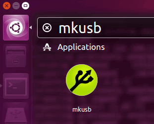](ubuntu-64-bit-2016-05-23-19-07-49.png)

The program will then prompt for your password:[](Ubuntu-64-bit-2016-05-23-19-07-59.png)

Then be shown the welcome screen:

[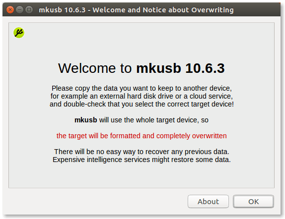](Screenshot-from-2016-05-23-02-08-25.png)

The first thing to do is select your source, use the file browser to select the Ubuntu ISO file.

[](screenshot-from-2016-05-23-02-08-56.png) [](Screenshot-from-2016-05-23-02-09-29.png)

Next, click on the **Live only selected** option to toggle it to **Persistent live selected** mode:

[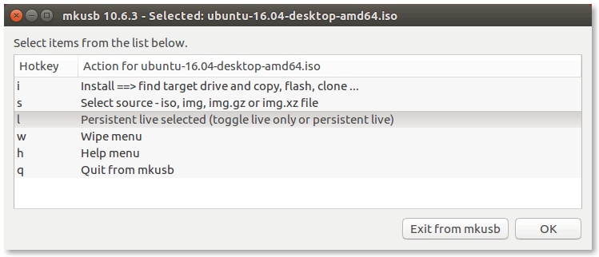](screenshot-from-2016-05-23-02-09-43.png)Finally click on the Install button to be brought to the next screen. Here you are shown devices connected to your computer:[
](screenshot-from-2016-05-23-02-10-07.png) [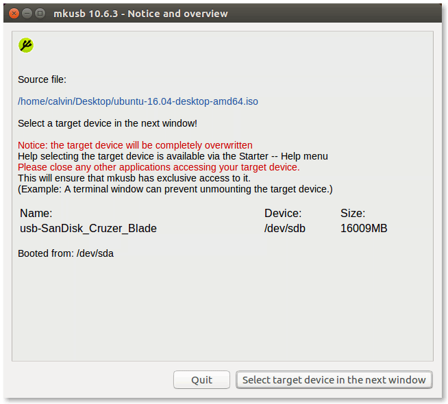](screenshot-from-2016-05-23-02-10-22.png)

Select your USB from the next screen or select **toggle USB-only; show all drives** if your USB is not showing, as it is being seen as a hard drive.

[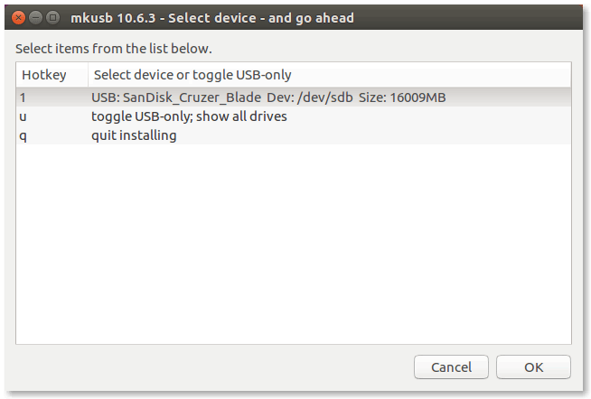](screenshot-from-2016-05-23-02-10-34.png)

Finally you will be brought to this screen which is the final confirmation before it wipes your drive:

[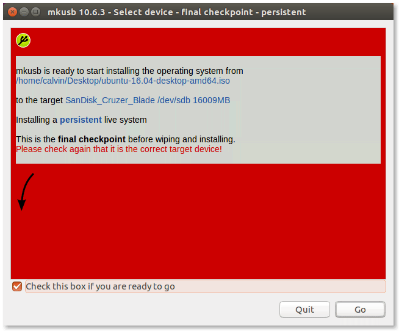](screenshot-from-2016-05-23-02-10-52.png)

Select the boot system and partition table which suits your needs. If your computer only has secure boot then you must either turn it off or choose **ISO file**. For the partition table, it is safe to go with GPT in most cases.

[](screenshot-from-2016-05-23-02-11-20.png) [](screenshot-from-2016-05-23-02-11-32.png)

Enter how much of the remaining space should be used for persistence which sits on-top of the Ubuntu Live USB. Any remaining will be normal USB storage:

[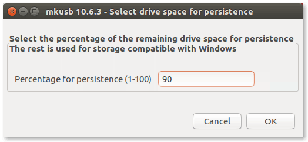](screenshot-from-2016-05-23-02-11-50.png)

When finished, you will be shown this screen:

[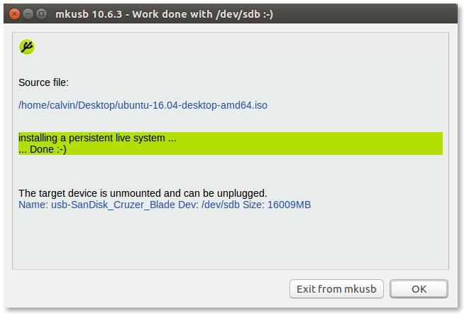](screenshot-from-2016-05-23-02-20-19.png)

Plug it in and see if works. In some cases you may have to change your BIOS from Legacy to UEFI or vice-versa if nothing is showing.

[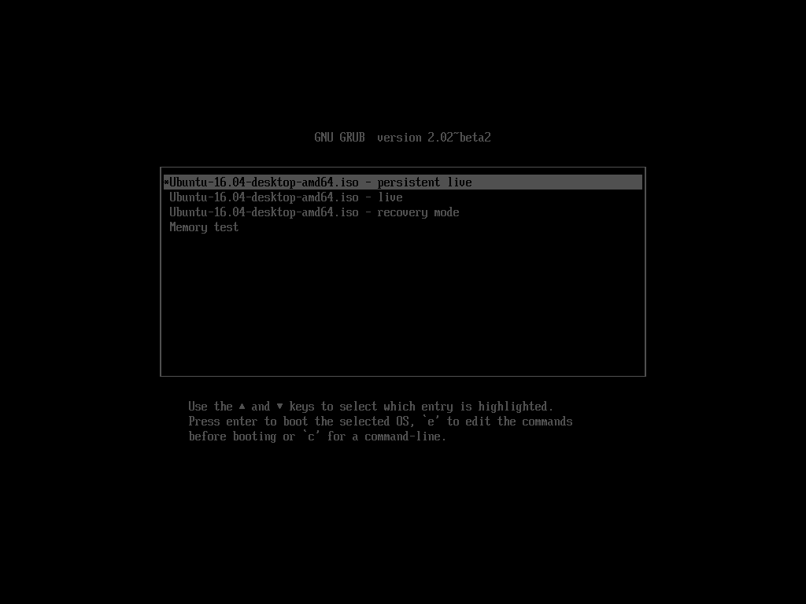](ubuntu-64-bit-2-2016-05-23-19-21-06.png)

[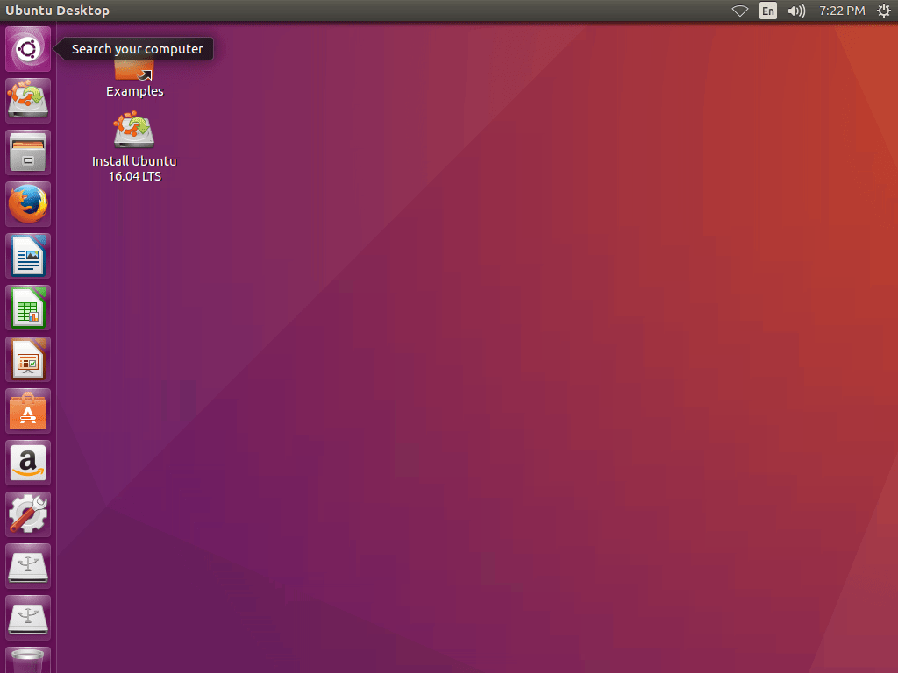](ubuntu-64-bit-2-2016-05-23-19-22-34.png)

Success!

## Extra: Boot the Live USB to RAM

When running applications or any read operations, everything is run from the USB drive. This can be slow depending on the type of USB used. A way around this is to have everything from the USB to be pushed into memory (RAM) which is a faster storage medium. For this to work you will need around 4GB or more of memory to be sure you don't run out.

The easiest way to test this out is when booting, hit the 'e' key to edit the boot options of Ubuntu. Add the word '**toram**' right after the word '**boot=casper**' and before '**quiet**' then hit F10 or Ctrl+X to boot. Booting will take a little longer as everything is being copied from the USB to memory.

[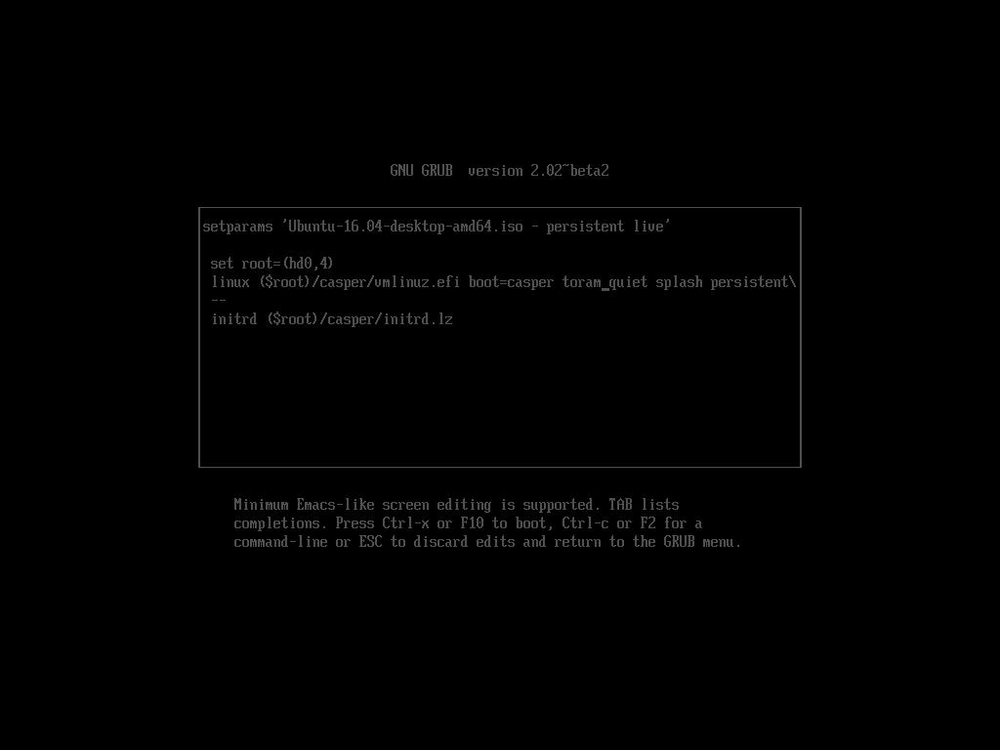](ubuntu-64-bit-2-2016-05-23-19-27-52.png)

To compare, here is my computer before and after using the 'toram' option:

[](toram-memory-usage.png)

To make the 'toram' permanent you will have to edit GRUB and add another entry to the boot options. First open up the Disks application.

[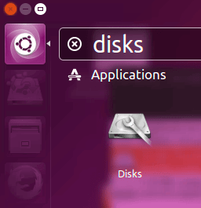](ubuntu-64-bit-2-2016-05-23-19-44-58-1.png)

Mount the 128MB partition of your USB by clicking the Play button when it is highlighted:

[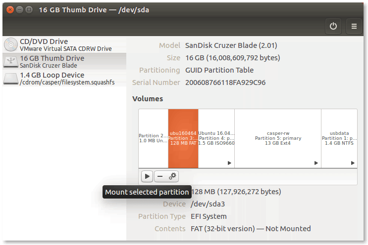](screenshot-from-2016-05-23-19-45-17.png)

The mounting location should now appear at the bottom-right. Click on this to browse to it.

[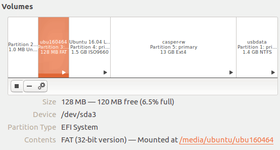](screenshot-from-2016-05-23-19-45-46.png)

Navigate to /boot/grub and open up grub.cfg in gedit or your favourite editor.

[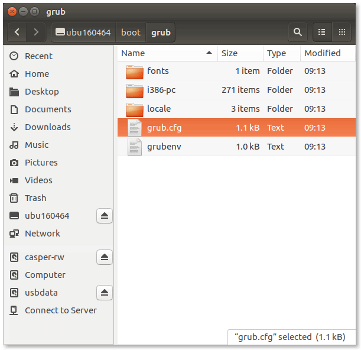](Screenshot-from-2016-05-23-19-46-18.png)

I have chosen to copy and paste the first menu entry and simply change it's name and add the toram option as you can see in this photo. Up to you how you would like to do this.

[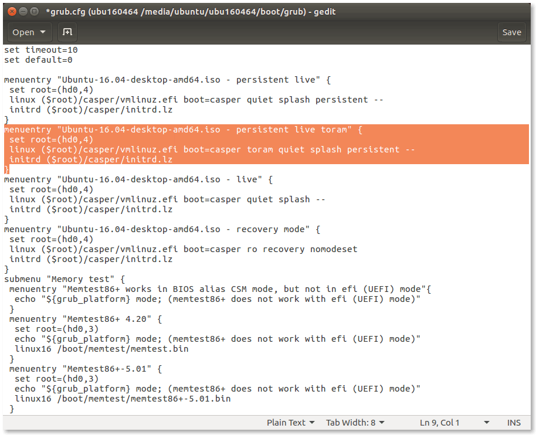](screenshot-from-2016-05-23-19-47-19.png)

Finally reboot and check if the option appears:

[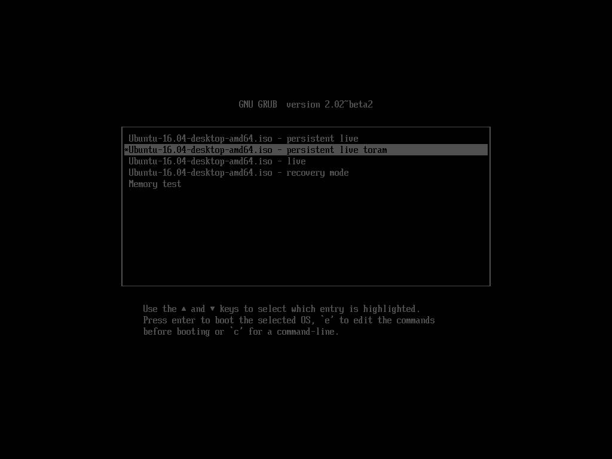](ubuntu-64-bit-2-2016-05-23-19-48-41.png)
