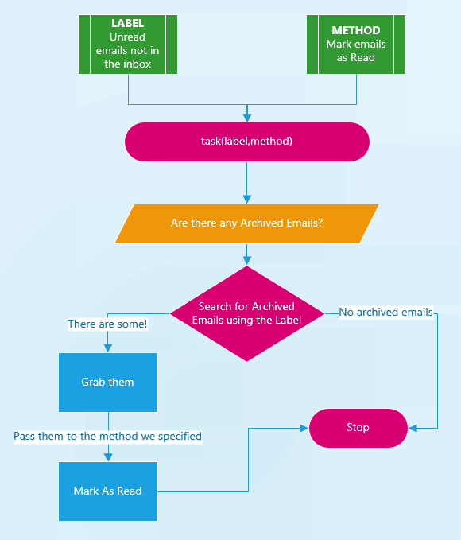

Isn't annoying that Gmail provides the option to either Archive or Delete emails from its notification? Well, no more! This script periodically moves Archived emails back into your Inbox and also marks them as read.

<!-- more -->

My first solution to this niggling problem was to use [XNotifications](https://play.google.com/store/apps/details?id=com.Taptigo.Xposed.XNotifications&hl=en) which adds the 'Mark As Read' option to Gmail notifications. XNotifications relies on the Xposed Framework which can be limiting to non-root or locked bootloader users. This was a simple solution but as time on went on, I became wary about how I would have to one day unroot and lock my bootloader.

The problem with Archiving emails is:

*   It does not show up in your inbox if unless you search for it
*   They are not Marked as Read and hence searching for unread emails will also pull them up annoyingly

## Solution

My way around either Archiving emails or Deleting emails has been using [Google Script](https://www.google.com/script/start/) to move Archived emails back into my Inbox periodically. Doing this, I would tap the Archive email option and it would move back into my Inbox every hour.

## The Script

This script searches for Archived emails, marks them as read, and moves them back into your inbox.

I would recommend doing this manually first as there's a daily usage limit on the Gmail API.

The two tags it searches are:

*   `label:unread -label:inbox`: Unread emails that are not in the Inbox.
*   `has:nouserlabels -in:Sent -in:Chat -in:Draft -in:Inbox`: Archived emails

```javascript
// the main run script
function run() {
  // unread emails, mark them as read
  task("label:unread -label:inbox", GmailApp.markThreadsRead.bind(GmailApp));
  // archived emails, move them into the Inbox
  task("has:nouserlabels -in:Sent -in:Chat -in:Draft -in:Inbox", GmailApp.moveThreadsToInbox.bind(GmailApp));
}

function task(label, method) {
  // if Archived Emails exist, do this method
  while(hasArchivedEmails(label)) {
    method(searchGmail(label));
  }
}

function hasArchivedEmails(query) {
  // is there archived emails?
  return Boolean(GmailApp.search(query).length > 0)
}

function searchGmail(query) {
  // search Gmail using a query, up to 100 results
  return GmailApp.search(query, 0, 99);
}
```

## How to Use

1.  Go to [https://script.google.com](https://script.google.com)
2.  Copy and paste the code above into the Editor
3.  Name the Project at the top
4.  Save it
5.  Go to "Resources > Current project's Triggers"
6.  Set up a new trigger with the 'Run' method for every hour or as long as you want.
7.  Press Save
8.  Review the permissions and authorisation  required to access Gmail when prompted

## Flowchart

This is a basic flow chart of how this script works.

[](flowchart.PNG)
