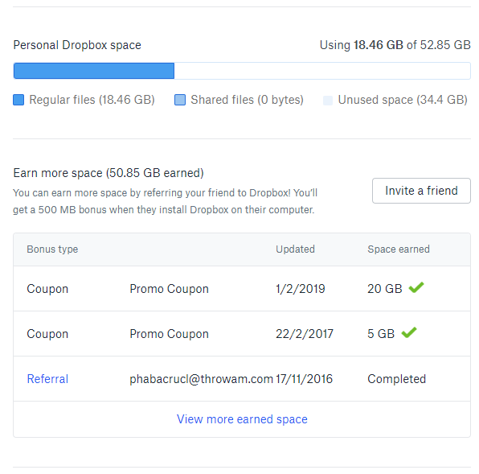
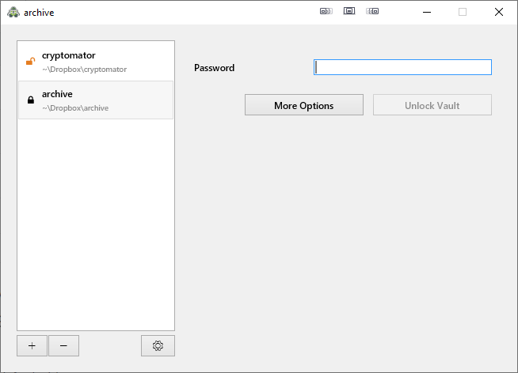
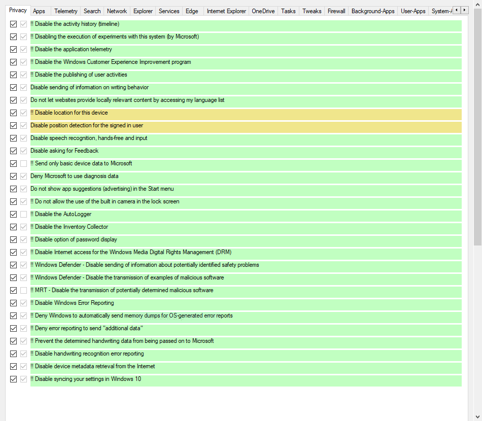
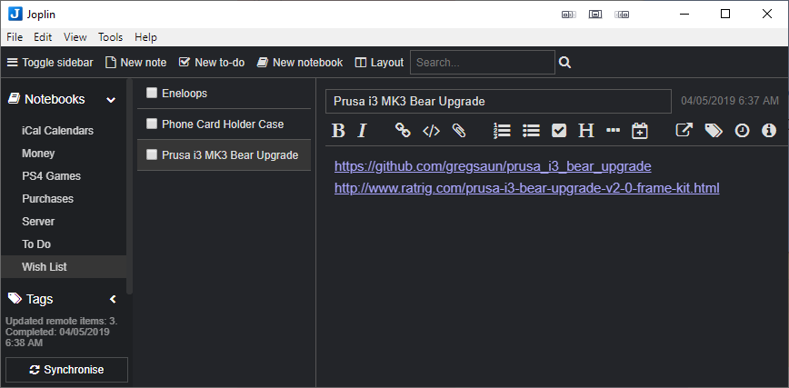
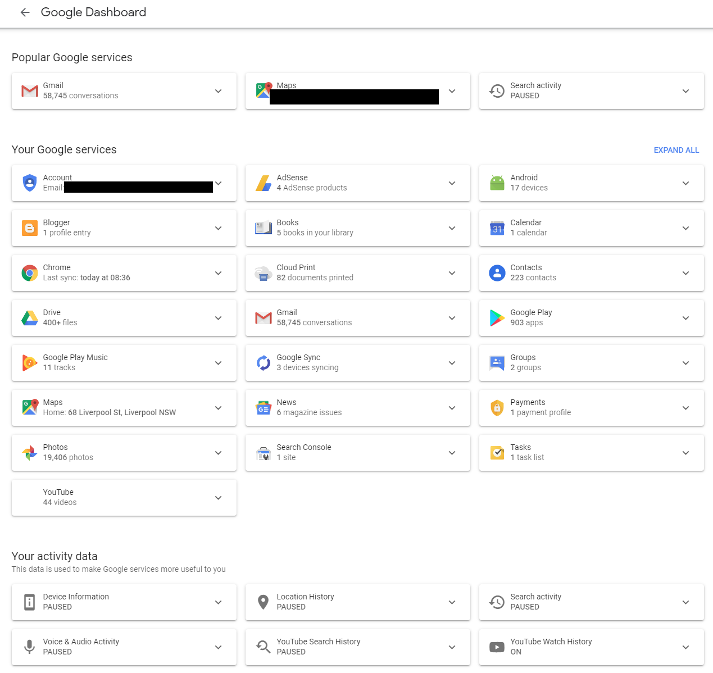

The applications and tools I've started using to increase my privacy and security.

<!-- more -->

## Privacy Matters

Privacy exists on different levels for different people, whatever is comfortable for you. This is referred to as a '[threat model](https://www.technadu.com/privacy-threat-modelling/46759/)'. If we truly all wanted to maximize privacy, we would all throw our mobile phones and computers out and live off the grid.

The ['Nothing to hide' argument](https://en.wikipedia.org/wiki/Nothing_to_hide_argument) usually comes up at this point. [Glenn Greenwald's TED talk](https://www.ted.com/talks/glenn_greenwald_why_privacy_matters?nolanguage=enFoundation) has the perfect counter-argument:

> I get out a pen. I write down my email address. I say, 'Here's my email address. What I want you to do when you get home is email me the passwords to all of your email accounts, not just the nice, respectable work one in your name, but all of them, because I want to be able to just troll through what it is you're doing online, read what I want to read and publish whatever I find interesting. After all, if you're not a bad person, if you're doing nothing wrong, you should have nothing to hide. Not a single person has taken me up on that offer. I check that email account religiously all the time. It's a very desolate place."

Another way I have visualise the importance of privacy is to think of the Google, Microsoft, Facebook, etc. as not big corporations, but instead as people and faces. Imagine the Google Home not as a device, but as someone sitting in your house, listening to everything you're doing. Alternatively, every Google search or site you browse, someone is standing over your shoulder, watching and following you across the Internet.

## What Google Has On Me

[Google provide a 'takeout' service](https://takeout.google.com/) which lets me download all the data they have on me.

The most interesting things I found were:

- 150MB of Location History via Google Maps of when I'm sitting, running, walking, in a vehicle, on public transport, etc.
- 200MB of browsing history going back to 2014
- Every YouTube video I've every watched
- Every YouTube search I've ever done

## Requirements

My digital life comprises of three main devices. The applications, services and alternatives must support all of them:

- Windows Desktop
- Android Mobile Phone
- Macbook Laptop

I'm also not in for self-hosting in case my server goes down when I really need it.

Free and open-source software (FOSS) will take priority as well over closed-source software.

## Quick Start

[privacytoolsIO](https://www.privacytools.io/) is a website that provides many tools to protect your privacy. They have done most of the heavy lifting when it comes to what to use.

[The Hated One](https://www.youtube.com/channel/UCjr2bPAyPV7t35MvcgT3W8Q) on YouTube is another great resource. [He provides a 24 min quick start guide for 2019.](https://www.youtube.com/watch?v=lLessJ4R6w8)

## VPN

I made a [previous post](/choosing-a-vpn-service) on my decision to use Mullvad.

## Google Chrome

Instead of Google Chrome, I've replaced it with **[ungoogled-chromium](https://github.com/Eloston/ungoogled-chromium)**. It is Google Chrome without any Google web services. I tried out Firefox but found the UI to be clunky.

Extensions I'm currently using:

- [AudioContext Fingerprint Defender](https://chrome.google.com/webstore/detail/audiocontext-fingerprint/pcbjiidheaempljdefbdplebgdgpjcbe)
- [Canvas Fingerprint Defender](https://chrome.google.com/webstore/detail/canvas-fingerprint-defend/lanfdkkpgfjfdikkncbnojekcppdebfp)
- [Cookie AutoDelete](https://chrome.google.com/webstore/detail/cookie-autodelete/fhcgjolkccmbidfldomjliifgaodjagh)
- [CSS Exfil Protection](https://chrome.google.com/webstore/detail/css-exfil-protection/ibeemfhcbbikonfajhamlkdgedmekifo)
- [Decentraleyes](https://chrome.google.com/webstore/detail/decentraleyes/ldpochfccmkkmhdbclfhpagapcfdljkj)
- [Nano Defender](https://chrome.google.com/webstore/detail/nano-defender/ggolfgbegefeeoocgjbmkembbncoadlb)
- [No Coin](https://chrome.google.com/webstore/detail/no-coin-block-miners-on-t/gojamcfopckidlocpkbelmpjcgmbgjcl)
- [Privacy Badger](https://chrome.google.com/webstore/detail/privacy-badger/pkehgijcmpdhfbdbbnkijodmdjhbjlgp)
- [Random User-Agent](https://chrome.google.com/webstore/detail/random-user-agent/einpaelgookohagofgnnkcfjbkkgepnp)
- [Referer Control](https://chrome.google.com/webstore/detail/referer-control/hnkcfpcejkafcihlgbojoidoihckciin)
- [Smart HTTPS](https://chrome.google.com/webstore/detail/smart-https/cmleijjdpceldbelpnpkddofmcmcaknm)
- [Tracking Token Stripper](https://chrome.google.com/webstore/detail/tracking-token-stripper/kcpnkledgcbobhkgimpbmejgockkplob)
- [uBlock Origin](https://chrome.google.com/webstore/detail/ublock-origin/cjpalhdlnbpafiamejdnhcphjbkeiagm)
- [uBlock Origin Extra](https://chrome.google.com/webstore/detail/ublock-origin-extra/pgdnlhfefecpicbbihgmbmffkjpaplco)
- [WebRTC Leak Prevent](https://chrome.google.com/webstore/detail/webrtc-leak-prevent/eiadekoaikejlgdbkbdfeijglgfdalml)

Afterwards I tested my browser against a few sites:

- [https://panopticlick.eff.org](https://panopticlick.eff.org)
- [https://browserleaks.com/canvas](https://browserleaks.com/canvas)
- [A list of sites from Reddit](https://www.reddit.com/r/privacytoolsIO/comments/bia6sx/test_your_privacy/)

My fingerprint from Browser Leaks:

## Android Google Chrome

On my phone, I'm using [Bromite](https://www.bromite.org/). Similar to ungoogled-chromium, it is a privacy enhanced web browser. From their website, it has:

> - baked-in adblock engine with filters from EasyList, EasyPrivacy, uBlock origin and others
> - remove click-tracking and AMP from search results
> - DNS-over-HTTPS support
> - Proxy configuration with PAC and custom proxy lists support
> - → StartPage, → DuckDuckGo and → Qwant search engines
> - chrome flags to disable custom intents and clear session on exit
> - always-incognito mode
> - removed privacy-unfriendly features
> - privacy enhancement patches from → Iridium, → Inox patchset, → Brave and → ungoogled-chromium projects
> - security enhancement patches from GrapheneOS project
> - canvas, audio and other anti-fingerprinting mitigations
> - import/export bookmarks
> - allow playing videos in background
> - all codecs included (proprietary, open H.264 etc.)
> - AV1 codec support
> - built with official speed optimizations

## DNS

DNS traffic by default is **not encrypted**. My ISP, Telstra, can see every DNS request I make.

A simple solution is to use Mullvad's DNS. If you can trust your VPN provider enough to use them, then you can trust their DNS enough to use it. However I wanted to spread out the information.

The more complicated solution and what I went with was **[DNSCrypt](https://dnscrypt.info/)**. DNSCrypt is a protocol for securing communications between a client and a DNS resolver. Their [FAQ page](https://dnscrypt.info/faq) has wonderful and easy to understand diagrams of DNS, DNSSEC, DNSCrypt, including their pros and cons

For setting up DNSCrypt on OPNsense, I followed these guides:

- [https://wiki.opnsense.org/manual/how-tos/dnscrypt-proxy.html](https://wiki.opnsense.org/manual/how-tos/dnscrypt-proxy.html)
- [https://arstechnica.com/information-technology/2018/04/how-to-keep-your-isps-nose-out-of-your-browser-history-with-encrypted-dns/](https://arstechnica.com/information-technology/2018/04/how-to-keep-your-isps-nose-out-of-your-browser-history-with-encrypted-dns/)

The OPNsense dnscrypt-proxy package provides a list of servers and picks out the fastest ones. I've set mine to lock to a server in Australia for faster browsing.

mDNS/Avahi may be using the same port as DNSCrypt. You can check this in OPNsense with the command: `tcpdump -i <vpn_interface> udp port 53`

I had to leave the **General DNS settings** in OPNsense to Mullvad VPN's DNS, as the OpenVPN profile connected over domain names instead of IP addresses. The initialisation steps will therefore be:

Boot -> Mullvad OpenVPN using Mullvad DNS -> DNSCrypt connection (over VPN) -> Connected

## Dropbox

My fear with Dropbox is that they scan and keep every single file I upload even after I delete it from my account. They are a US based company and I wouldn't be surprised.

Storage is expensive, and I don't like paying for things that were already free. I use Dropbox because I have 53GB from a whole bunch of different campaigns and promotions.

A good workaround I found was to encrypt and decrypt Dropbox files on the fly. There were already a few solutions floating around and one of them, gocryptfs, even has a [comparison page](https://nuetzlich.net/gocryptfs/comparison/).

While the page doesn't list it, only one of them supported Windows, MacOS and _Android_ devices and that was **[Cryptomator](https://cryptomator.org/)**. It was the only one that supported Android and was a good enough for my use. [Cryptomator's Android app](https://play.google.com/store/apps/details?id=org.cryptomator&hl=en_AU) at time of writing is $15 AUD.

One downside of Cryptomator is it encrypts entire folders so [Dropbox's Selective Sync](https://help.dropbox.com/syncing-uploads/selective-sync-overview) feature no longer works. To work around this I made a normal `cryptomator` folder of everything I usually sync and an `archive` folder for everything else. It isn't a perfect solution as something like this will require a big download and upload whenever I decide to move folders around. [gocryptfs](https://nuetzlich.net/gocryptfs/) is able to work around this issue by encrypting the files contents while leaving folder and filenames in plain text. It is also much faster than cryptomator (and cryptfs) in my tests. [If only a gocryptfs Android app existed](https://github.com/rfjakob/gocryptfs/issues/239).

## KeePassXC Password Manager

I've been using KeePass for a few years now so there is no change required here. The KeePass database is already encrypted so it is safe enough for me to store in the database.

For clients, I use:

- [KeePassXC](https://keepassxc.org/) for Windows and Mac
- [KeePassXC-Browser](https://chrome.google.com/webstore/detail/oboonakemofpalcgghocfoadofidjkkk) for Chrome
- [Keepass2Android](https://github.com/PhilippC/keepass2android) for my Android Phone
- [Keepass2Android Autofill Plugin](https://github.com/PhilippC/kp2a_accservice_autofill) for autofill support on Android. It doesn't see URLs in Bromite so they entries will have to be manually selected.

## Windows 10

I'm sticking with Windows 10 because of the support it has for games I play. Gaming on Linux has gotten really good, but not at the level I'm satisfied with.

Windows 10 sends a lot of telemetry data by default and this can be turned down from the Settings App. I took things a bit further and used [W10Privacy](https://www.winprivacy.de/english-home/) turned off everything that was possible to turn off.

## Google Keep

I'm a big user of Google Keep to store notes, lists and to-do lists. While there is nothing there that is sensitive besides some gift card numbers, I wanted to see if I could rid myself of this Google product.

The very good, non-Google alternative is [Notebook by Zoho](https://www.zoho.com/notebook/). Their [privacy policy](https://www.zoho.com/notebook/business-model.html) states they never read your notes, but do mention their 'Zia AI technology' will scan it. Zoho Notebook also has [encryption at rest](https://www.zoho.com/notebook/blog/notebook-update-introducing-encryption-at-rest-night-mode-enhanced-apple-pencil-support-and-more.html) and an Android app (with widgets!). Ultimately, Zoho was a US company and I opted not to trust them with this.

[Standard Notes](https://standardnotes.org/) was another option I considered. Their always free tier editor was plain text editor, not as powerful as I would've liked.

I decided to go with the open source **[Joplin](https://joplinapp.org/)** application. Joplin stores notes inside Dropbox with an encrypted key. I am then synchronising it across my devices and decrypting it with the key.

In terms of workflow, Jolpin is hierarchically different to Google Keep. I tried a few different approaches and felt best with the following:

- Google Keep 'Note' becomes a Joplin 'Notebook'
- Google Keep 'tick box' becomes a Joplin 'To do' title

As every 'To do' is a technically a note, I could add some more information underneath each.

## Gmail

We all know Google scans Gmail. According to Google, I have 58000 emails in my Gmail. That's a lot to go through but I'm sure they'll find something they like in there. The truth ultimately is most people use Google or Microsoft to send their emails, and when I reply, Google will get my reply too. There's not much I can do here, but I'll try my best.

For an email provider, I had the following requirements:

- Calendar and CalDAV
- Contacts and CardDAV
- Ability to flag emails (either via IMAP or app) across devices
- IMAP IDLE for push notifications
- Support for custom domains
- Catch-all alias
- Not part of the [five eyes](https://restoreprivacy.com/5-eyes-9-eyes-14-eyes/)
- Encrypted at rest

I chose to go with **[mailbox.org](https://mailbox.org/en/)** based in Germany. Another provides that met my requirements was [Mailfence](https://mailfence.com/en/), however I wasn't happy with their email and calendar integration. I find mailbox.org to be very slow to do anything on their web interface. Accessing it through an email client is more bearable but slower when I compare it to another interface like ProtonMail or FastMail.

## Email Clients

On Windows and Mac I am using **[Thunderbird](https://www.thunderbird.net/en-US/)** which has both email and calendar integration.

For Android apps, I avoid apps that [Mike Kuketz found sending passwords to their services](https://www.kuketz-blog.de/mail-apps-zahlreiche-android-apps-uebermitteln-login-passwort/) like Blue Mail and Edison Mail. CK also has a [list of email apps that take privacy seriously](https://chefkochblog.wordpress.com/2017/12/22/list-of-secure-email-apps-that-take-privacy-serious/). With that, I tried out [MailDroid](https://play.google.com/store/apps/details?id=com.maildroid), [K9-Mail](https://k9mail.github.io/) and [Nine](http://www.9folders.com/). Nine would not properly open .ics calendar invites. MailDroid wasn't open source. So **K9-Mail** it is!

## Google Calendar

Both Calendar and Contacts are supported by my email provider, mailbox.org, so it really about how I could get them shared and synced around.

On Windows and Mac, I mentioned before that **[Thunderbird](https://www.thunderbird.net/en-US/)** handled this for me.

On Android, I had to get a few apps to get everything syncing. Firstly, I needed to sync my calendars over CalDAV using **[DAVx⁵](https://f-droid.org/en/packages/at.bitfire.davdroid/)** (formerly DAVdroid). CalDAV is an Internet standard for syncing Calendar information. I also had some `.ics` calendars like my Facebook events that were stored at a URL endpoint. To sync these, I used **[ICSx⁵](https://f-droid.org/en/packages/at.bitfire.icsdroid/)** by the same developer. Both apps are free on F-Droid, but are paid on the Google Play Store.

For the Android Calendar app, I switched to the open source **[Etar Calendar](https://github.com/Etar-Group/Etar-Calendar)**. Etar is able to display any Calendars that are stored in Android's local Calendar storage which have been synced by DAVx⁵ and ICSx⁵.

## Google Contacts

I only ever need my contacts on my phone, never on my computer. I used the same syncing app for my calendar, **[DAVx⁵](https://f-droid.org/en/packages/at.bitfire.davdroid/)** , which is also able to sync contacts over CalDAV. I exported my contacts from [Google Contacts](https://contacts.google.com) as a CSV file and imported them into mailbox.org.

## Google Play Store

Getting rid of the Google Play Store and Google Play Services doesn't do much as I'm not using a custom ROM, but there are alternatives out there. An open-source alternative to the Play Store is **[F-Droid](https://f-droid.org/en/)** which contains free and open-source Android apps. For apps that aren't open-source or to use the Google Play Store without logging in, **[Aurora Store](https://f-droid.org/en/packages/com.aurora.store/)** is able to download and update from Google's servers. **[APKMirror](https://www.apkmirror.com/)** is another alternative, with an unofficial client/web app [available on F-Droid](https://f-droid.org/en/packages/taco.apkmirror/).

## Other Applications

Some other smaller applications I've replaced with FOSS alternatives that have less/no trackers:

- Loyalty Cards: [Stocard](https://stocardapp.com/en/au) with [Loyalty Card Keychain](https://f-droid.org/en/packages/protect.card_locker/)
- Smart Watch: Pebble with [Gadget-bridge](https://gadgetbridge.org/)
- Reddit: [Joey](https://play.google.com/store/apps/details?id=o.o.joey&hl=en_AU) with [Slide](https://f-droid.org/en/packages/me.ccrama.redditslide/)
- Podcasts: [Pocket Casts](https://www.pocketcasts.com/) with [AntennaPod](https://antennapod.org/)
- GPS Spoofer: [Location Changer](https://play.google.com/store/apps/details?id=com.locationchanger&hl=en_US)

## Cleaning Up Google

When I did all the above, I thought it would be a good idea to clean out my Google history and activities. I'm not sure if it does anything but at least it's worth a try. [Google provide a hub with every single service you use](https://myaccount.google.com/). From here you can:

- [Delete services](https://myaccount.google.com/delete-services-or-account) you no longer use
- [Dashboard](https://myaccount.google.com/dashboard): See details about services you currently use
- [Change what Google tracks](https://myaccount.google.com/data-and-personalization)
- [Download all the data Google has on you](https://takeout.google.com/)

## Services not going away

There are some Google services I want to get rid of but currently cannot:

- **Google Photos**: Free unlimited photo backup is definitely something I may never find. Combine that with a very good search feature for different people, places and things.
- **YouTube**: Is it even possible anymore?
- **Google Play Services**: Android Auto requires this installed to work. If not for this, I would've switched to [microG](https://microg.org/)
- **Google Pay**: The only alternatives are Apple Pay, Samsung Pay, FitBit Pay or bringing my cards everywhere. Unfortunately the banking network is a closed system and they would probably never let an open-source product work with them.
- **Google Maps**: All the alternatives suck. I've tried Qwant, HERE and OSM. A simple search for my workplace and the Hungry Jacks at Circular Quay never give the correct results.
- **Google Home Devices**: [Project Alias](https://www.instructables.com/id/Project-Alias/) is a good idea, but doesn't seem like it's worth the trouble.

## Conclusions

This has become a _get rid of everything Google Product X_ post and there's already a [subreddit](https://www.reddit.com/r/degoogle/) for that and a [heap](https://restoreprivacy.com/google-alternatives/) [of](https://www.telepresenceoptions.com/2018/10/bye_google_alternatives_to_goo/) [sites](https://nomoregoogle.com/) on how to do that as well. But that shows how deep I'm in with their products. Tangibly, I'm not sure what I've achieved from this but I can sleep a bit easier knowing not every single move I make is being watched, recorded or tracked.

To summarise the products I've mentioned:

- VPN: [Mullvad](https://mullvad.net/en/)
- Browser: [ungoogled-chromium](https://github.com/Eloston/ungoogled-chromium)
- Android Browser: [Bromite](https://www.bromite.org/)
- Windows 10: [W10 Privacy](https://www.winprivacy.de/english-home/)
- DNS: [DNSCrypt](https://dnscrypt.info/)
- Cloud Storage: Dropbox encrypted with [Cryptomator](https://cryptomator.org/)
- Password Manager: [KeePassXC](https://keepassxc.org/)
- Notes: [Joplin](https://joplinapp.org/)
- Mail, Calendar & Contacts Provider: [mailbox.org](https://mailbox.org/en/)
- Windows and Mac Email Client: [Thunderbird](https://www.thunderbird.net/en-US/)
- Android Email Client: [K9-Mail](https://k9mail.github.io/)
- Android Calendar Sync: [DAVx⁵](https://f-droid.org/en/packages/at.bitfire.davdroid/), [ICSx⁵](https://f-droid.org/en/packages/at.bitfire.icsdroid/) and [Etar Calendar](https://github.com/Etar-Group/Etar-Calendar)
- Android Contacts Sync: [DAVx⁵](https://f-droid.org/en/packages/at.bitfire.davdroid/)
- Google Play Store: [F-Droid](https://f-droid.org/en/) and [Aurora Store](https://f-droid.org/en/packages/com.aurora.store/)

## Next Steps and Future

- Get an Android device that supports custom ROMs to have less Google services
- Tutanota and ProtonMail are developing Calendars. If they can sync across mobile I will move from mailbox.org to one of those.
- Remove Google Analytics from this site (done)
- Figure out how to sync bookmarks
- Find an alternative to Google Home
- Find a workaround to using Android Auto without Play Services
