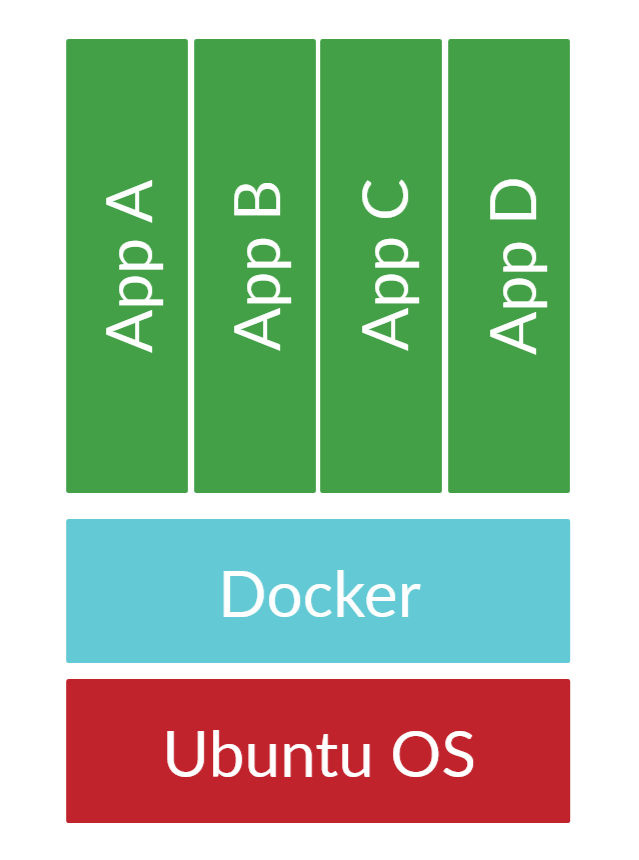
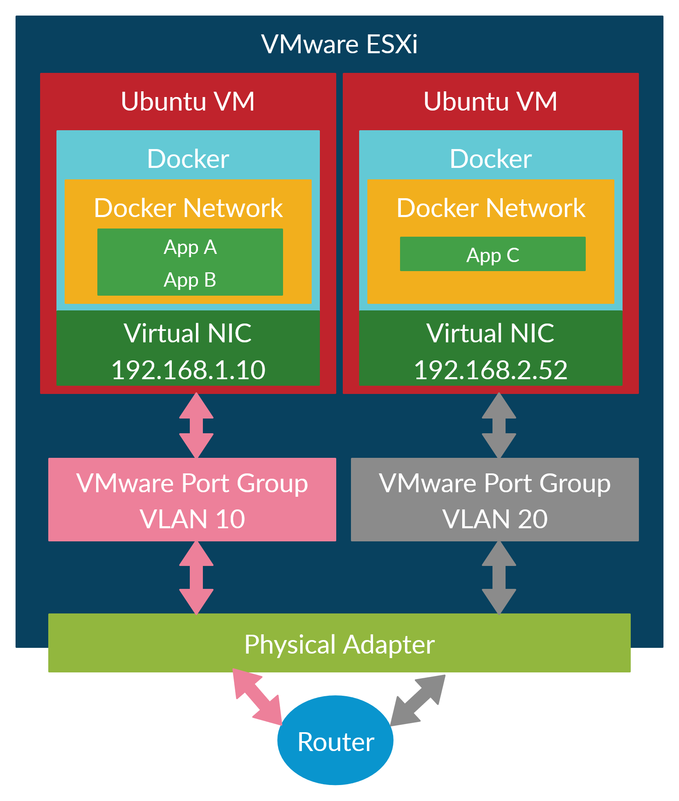

My journey from VMware ESXi to purely Docker.

<!-- more -->

# Setup 1 - 2014: VMware ESXi VMs

[](v1.png){:target="_blank"}

When I first started my homelab 5 years ago, I went with [VMware ESXi](https://www.vmware.com/au/products/esxi-and-esx.html) as my hypervisor and a slew of [Ubuntu](https://ubuntu.com/)/[CentOS](https://www.centos.org/) virtual machines because that's what I had learnt from my [internship at IBM](https://www.ibm.com/au-en/employment/internship.html). This, combined with [VLANs](https://en.wikipedia.org/wiki/Virtual_LAN) for network separation gave me a complete virtualisation environment where I could do whatever I wanted without comprising any service.

The _benefits_ of this setup were:
- [Virtual machine snapshots](https://kb.vmware.com/s/article/1015180#Whatisasnapshot) for quick rollbacks and testing
- Resize/stop/start virtual machines whenever a particular application was needed
- Each application ran in its own virtualised server so it didn't need to contend with others for resources

The _downsides_ of this setup were:
- Installing the OS, installing packages, setting up SSH, setting up networking and other things whenever I set up a new virtual machine
- I had to test each piece of software individually for how much memory and disk space was necessary, then delete it all do a proper build from scratch
- Always running out of RAM as I was limited to 32GB

# Setup 2 - 2017: VMware ESXi VMs with Docker

[](v2.png){:target="_blank"}

As I was low of memory, I gave [Docker](https://www.docker.com/) a try and was amazed by the reduction in memory usage. Before I knew much about Docker, I assumed a Docker container was another operating system so it would use as much memory as a virtual machine. Docker containers, however, are [very lightweight and make use of the existing kernel](https://www.docker.com/resources/what-container).

An example of this for running my downloading applications, in **Setup 1** where I ran one server per application:

```text
VM1 - NZBGet       - RAM: 1GB
VM2 - Sonarr       - RAM: 2GB
VM3 - Radarr       - RAM: 2GB
VM4 - Transmission - RAM: 1GB
VM5 - NZBHydra     - RAM: 2GB
VM6 - jDownloader  - RAM: 2GB

Total - 10GB RAM
```

But in **Setup 2**, I was able to combine common applications or applications that communicated with each other:

```text
VM1: Docker (NZBGet, Sonarr, Radarr, Transmission, NZBHydra, jDownloader)
RAM: 8GB
```

This saw a 2GB drop in RAM usage. Not much, but this is just one example! Other services I combined in Docker pushed those RAM savings further while keeping the maintainability of the system.

The _benefits_ of this setup were:
- Lowered RAM use as I was able to combine applications and run them on the same server
- Better maintainability through Docker instead of installing directly to the server
- Each VM was still network separated from others with VLANs

The _downsides_ of this setup were:
- Still had to create a virtual machine each time I wanted a new service. This meant installing the OS, installing packages, setting up SSH, setting up network etc. all over again
- Was still tinkering with virtual machine sizing

# Setup 3 - 2019: Docker only

[](v3.png){:target="_blank"}

Considering the downsides of **Setup 1** and **Setup 2**, I decided it was time to go a bit further. There were a few considerations:

Looking at the transition of **Setup 1** (one application per server) to **Setup 2** (multiple Docker applications per server), I was able to combine multiple Ubuntu servers into one. This removed about 200MB of RAM usage and 400MB of disk space for each Ubuntu host that was removed.

In **Setup 2** (multiple Docker applications per server), there were still multiple instances of:
- Ubuntu
- Docker
- Virtual machines

So I thought, why not combine this all together into one to remove the overhead? The above diagram summarises it nicely. I still maintain all the same benefits as before while removing the downsides I previously had.

To migrate to a Docker only environment however, there were two solutions I had to find an answer for:
- **Networking**: maintaining network separation within Docker when running on a single host.
- **Windows**: How do I run any Windows applications on a Linux host?

# Docker Networking with VLANs

The hardest part of all this was to be able to separate Docker container to different networks so they wouldn't be able to communicate with each other, or hosts not on their network. I found a solution that worked on a single network interface and supported VLANs.

To give some perspective, this was what my previous setup on VMware ESXi looked like. Each port groups would have a VLAN tag:

[](vmware-networking.png){:target="_blank"}

Playing around with Ubuntu's new network configuration tool [NetPlan](https://netplan.io/), I was able to create multiple VLANs off a single interface `eno1`. I set the default gateway to be `eno1.10`, while the other VLANs did not require an IP address (although you could add one if you like):

```yaml
network:
  version: 2
  ethernets:
    eno1: {}
  vlans:
    eno1.10:
      addresses:
        - 192.168.1.3/24
      gateway4: 192.168.1.1
      id: 10
      link: eno1
      nameservers:
        addresses:
          - 192.168.1.1
    eno1.20:
      id: 20
      link: eno1
    eno1.30:
      id: 30
      link: eno1
    eno1.40:
      id: 40
      link: eno1
```

Then within Docker, I used the `macvlan` network driver to physically connect Docker container to a network interface:

```shell
VLAN: 10
Subnet: 192.168.1.0/24
Gateway: 192.168.1.1
Parent: eno1.10
DNS: 192.168.1.1

$ docker network create \
  -d macvlan \
  --subnet=192.168.1.0/24 \
  --gateway=192.168.1.1 \
  -o parent=eno1.10 \
  --ip-range=192.168.1.128/26 \
  mgmt
```

Now I have a network called `mgmt` which is connected to `eno1.10`. Sadly any containers on the network won't use DHCP so you will have to provide an `ip-range` for Docker to use. It doesn't care if there's something in that range so be careful.

To create a Docker container on that network:

```shell
docker run --rm --network mgmt busybox sh -c "ping 192.168.1.1"
```

To enable DNS however, you will have to specify it with `--dns` or it will use the host computer's DNS which may be inaccessible if the container is on a different network:

```shell
# --dns x.x.x.x
docker run --rm --network mgmt --dns 192.168.1.1 busybox sh -c "ping calvin.me"
```

To set an IP address, provide the `--ip` option:

```shell
# test we can't ping other VLAN networks
docker run --rm --network mgmt --ip 192.168.1.20 busybox sh -c "ping 192.168.2.5"
```

So that now solves our networking so be exactly like before. Each Docker network corresponds to a real network and each container is physically separated from other containers within the same host. Here's a diagram of it:

[](docker-networking.png){:target="_blank"}

# Running Windows Applications

Short answer is _don't..._

Longer answer is there are two options:
1. Run a headless virtual machine inside the host (thought we could escape them?). [Ubuntu provide decent docs](https://help.ubuntu.com/community/KVM/Installation) for KVM/QEMU and with an [X11 Server](https://mobaxterm.mobatek.net/) you can always get a GUI through [virt-manager](https://virt-manager.org/). Combine this with bridging and you should get network separation.
2. Find a hacky solution. _Read on._

I've gone with option 2 to run [Blue Iris](https://blueirissoftware.com/), my video surveillance software. [jshridha](https://hub.docker.com/r/jshridha/blueiris) has created a Docker image that runs Blue Iris on top of [Wine](https://www.winehq.org/).

So Wine in Docker on Linux...a recipe for disaster.

# Final Result

Here are stats of the homelab as of right now, running everything I have in the past:

```text
Load average: 1.48, 1.31, 1.16
Memory: 5.59G/31.4G
Swap: 2.31G/8.00G

Running Docker containers: 28
```

An incredible result when considering I was previously running out of memory, to now not even using half of it.

Now a final benefits and downsides:

_Benefits_:
- Considerably less memory use
- Quick to spin up and delete a new application (e.g. `docker run --network mgmt --dns 192.168.1.1 nextcloud`) as I no longer need to install Ubuntu, configure networking and everything else that comes with building a new host
- No more virtual machine sizing guessing games
- Direct access to hardware, meaning hardware acceleration!

_Downsides_:
- No more snapshots, everything should be isolated in a Docker container at which is halfway there.
- Have to manually allocate IP addresses and DNS as no DHCP

# Future?

Seeing that I made a big change every 2-3 years, this is my guess:

- [Kubernetes](https://kubernetes.io/)? Perhaps too complicated for this setup and will require new solutions to networking and storage. However, K8S may become simpler in the future (see [k3s](https://github.com/rancher/k3s) for example)
- A lighter operating system than Ubuntu like [CoreOS](https://coreos.com/) or [RancherOS](https://github.com/rancher/os) but then I would have to figure out networking again and if it works with Ansible.
- What if every application becomes a [serverless application](https://serverless.com/)?
