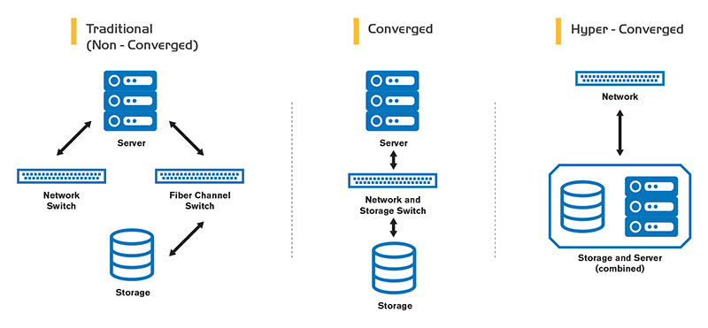
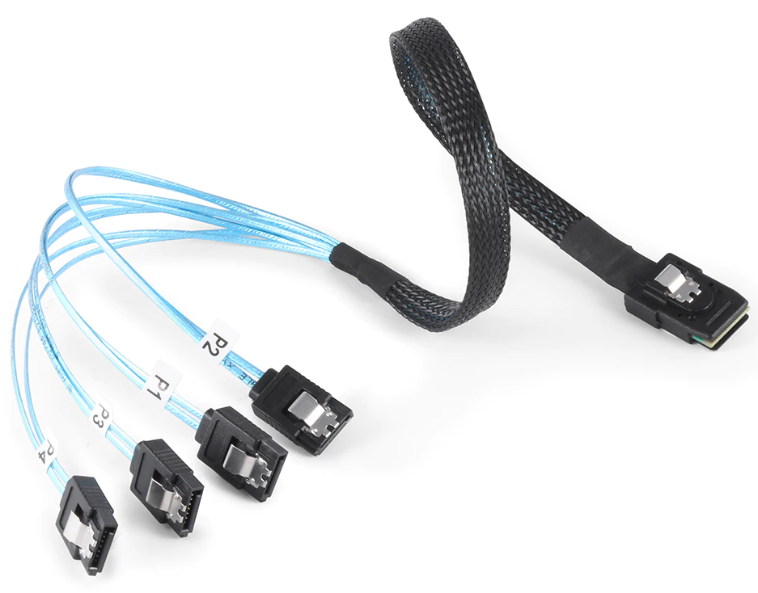
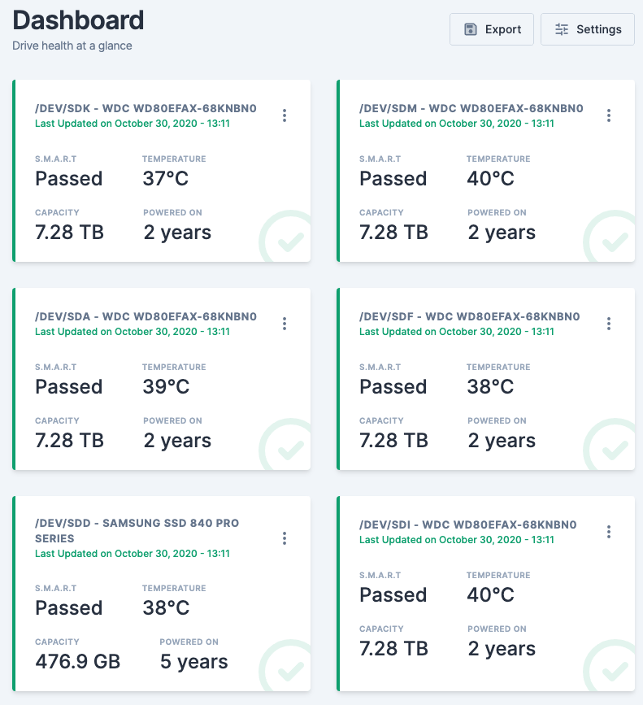
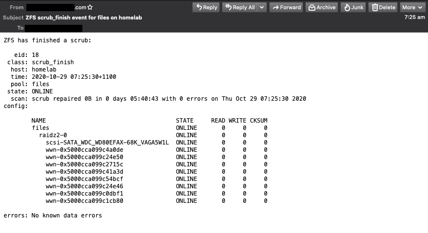

I merged all my home servers together to improve performance while reducing power usage.

<!-- more -->

```toc
# This code block gets replaced with the TOC
```

## Preface

In one of my first ever posts, I shared my [all-in-one server](/all-in-one-esxi-server) which has since been split into a separate application server running pure [Docker containers](/migrating-from-vms-to-docker) and a [72TB FreeNAS storage server](/my-72tb-freenas-server).

There was an imbalance however. The storage server was way more powerful than the application server yet acted as an archive and used infrequently. It didn't need its 128GB of RAM and Intel Xeon E5 CPU for that. If I swapped the hardware out with the application server, the combination of 32GB of RAM and 72TB of raw disks would have made FreeNAS/ZFS unstable. I decided the best action was to combine my application and storage server together.

The act of merging application, storage and network devices is known as [hyper-converged computing](https://en.wikipedia.org/wiki/Hyper-converged_infrastructure) This excellent diagram below from [helixstorm](https://www.helixstorm.com/blog/hyperconverged-infrastructure/) outlines the different types of infrastructures possible.



To achieve this I needed to:

1. Get more drives into my already cramped server
2. Run ZFS on Linux instead of FreeNAS. Docker containers aren't supported on FreeNAS
3. Enable monitoring for ZFS on Linux

## Adding more drives

My [Norco RPC-431](http://www.norcotek.com/product/rpc-431/) only supports 9x3.5" drives and 1x2.5" drive. I needed to add and extra 1x3.5" and 2x2.5" drives used for my security cameras and the operating system. My [Supermicro X10SRi-F](https://www.supermicro.com/products/motherboard/xeon/c600/X10SRi-F.cfm) motherboard also has only 10 SATA ports. I had to get a bit creative.

### HP H220 (LSI SAS2308)

Adding more SATA ports is an easy task with a RAID card running in IT mode. Thanks to the ServeTheHome forums, I was able to go through all [a list of all models](https://forums.servethehome.com/index.php?threads/lsi-raid-controller-and-hba-complete-listing-plus-oem-models.599/) and their OEM counterparts.

I decided I wanted a SAS2308 or newer card as they support SATA3 (6Gb/s) speeds for my SSDs. Searching each one on eBay, I found the HP H220 for around AUD $55.


I also grabbed two cables mini-SAS (SFF-8087) to SATA cables from AliExpress for around AUD $8.



When I received the card, I performed a firmware upgrade [following this guide from tifan.net](https://tifan.net/blog/2019/01/28/hp-h220-lsi-2308-9207-8i-stock-firmware-on-dell-r720/). Since the files there may one day disappear, I've uploaded the [PH20.00.07.00-IT.zip firmware](PH20.00.07.00-IT.zip) and [P14 sas2flash.efi](sas2flash.efi) tool on my site too. Here are the EFI shell commands:

```shell-session
$ sas2flash.efi -o -e 7
$ sas2flash.efi -f 2308T207.ROM
$ sas2flash.efi -b mptsas2.rom
$ sas2flash.efi -b x64sas2.rom
$ sas2flash.efi -o -sasaddhi <first 7 digits of SN>
```

### 3D Printed PCI Drive Mounts

The only free space left in the case were where the PCI slots were. I found a some 3D prints off Thingiverse for hard drive PCI mounts:

- [3.5" mount by pushbx](https://www.thingiverse.com/thing:133833)
- [2.5" mount by BearTechandTools](https://www.thingiverse.com/thing:946543)

I was able to squeeze one 3.5" and two 2.5" together on my 3D printer.


I mounted them with normal screws.


With the drives and RAID card installed into the system, before wiring up the spaghetti:


I re-installed Ubuntu from scratch to be safe. I was able to follow my [previous post on setting up RAID1 for 18.04](/install-ubuntu-18.04-on-raid1) on 20.04 with some small wording changes.

## ZFS on Linux

### Importing the ZFS ZPool in Linux

First I installed the zfs package:

```shell-session
$ apt install zfsutils-linux
```

Running `zpool import` lists all the possible pools that can be imported:

```shell-session
$ zpool import

   pool: files
     id: 11082528084113358057
  state: ONLINE
 status: The pool was last accessed by another system.
 action: The pool can be imported using its name or numeric identifier and
	the '-f' flag.
   see: http://zfsonlinux.org/msg/ZFS-8000-EY
 config:

	files       ONLINE
	  raidz2-0  ONLINE
	    sdi     ONLINE
	    sdk     ONLINE
	    sdj     ONLINE
	    sdd     ONLINE
	    sda     ONLINE
	    sdm     ONLINE
	    sdl     ONLINE
	    sdc     ONLINE
	    sdb     ONLINE
```

I imported the pool with the special `-d /dev/disk/by-id` option so it auto-mounts after reboots:

```shell-session
$ zpool import -f -d /dev/disk/by-id files
```

I also performed an upgrade to get the latest features:

```shell-session
$ zpool upgrade files

This system supports ZFS pool feature flags.

Enabled the following features on 'files':
  large_dnode
  edonr
  userobj_accounting
  encryption
  project_quota
  allocation_classes
  resilver_defer
  bookmark_v2
```

Also changed the mountpoint as it mounted to `/files` by default:

```shell-session
$ zfs get mountpoint files
NAME   PROPERTY    VALUE       SOURCE
files  mountpoint  /mnt/files  local

$ mkdir /mnt/files
$ zfs set mountpoint=/mnt/files files
```

### Setting up SMB (Samba)

FreeNAS made sharing zpools easy with GUI options for SMB/CIFS, FTP, etc. I had to set up SMB myself and you can find it in my [Ansible playbook](https://github.com/calvinbui/ansible-monorepo/commit/01ba996ef0777ae61fbc4a725538ff62f6dc8481). The only thing it doesn't do is set `smbpasswd` which isn't possible with Ansible yet.

```shell-session
$ sudo smbpasswd -a calvin
New SMB password:
Retype new SMB password:
added user calvin
```

If you're using Nextcloud like me, I updated the [External Storage](https://docs.nextcloud.com/server/latest/admin_manual/configuration_files/external_storage_configuration_gui.html) app to use a local mountpoint instead of SMB.

## Monitoring

FreeNAS provided alerts ZFS and disk health events. To replicate this as close as possible, I used different tools. You can these in my [Ansible ZFS playbook](https://github.com/calvinbui/ansible-monorepo/commit/4c99e906e805824929a198e5bb87b34ffbb0fd2d).

### zfswatcher

[zfswatcher](https://github.com/rouben/zfswatcher) is a ZFS pool monitoring and notification daemon. A [Docker image is provided by Pectojin](https://github.com/Pectojin/docker-zfswatcher). It is able to send email alerts on a [variety of ZFS events](https://github.com/damicon/zfswatcher/blob/master/etc/zfswatcher.conf#L54).


### scrutiny

[scrutiny](https://github.com/AnalogJ/scrutiny) provides a web interface for drive S.M.A.R.T. monitoring. It is also able to send alerts to a lot of services with its [shoutrrr implementation](https://containrrr.dev/shoutrrr/services/overview/)



### ZFS ZED

[zed](https://zfsonlinux.org/manpages/0.8.0/man8/zed.8.html) is the built-in ZFS on Linux Event Daemon that monitors events generated by the ZFS kernel. Whenever a new ZFS event occurs, ZED will run any ZEDLETs (ZFS Event Daemon Linkage for Executable Tasks) created under `/etc/zfs/zed.d/`. I didn't add any new ZEDLETs and went with the default provided.

A mail provider is required on the host as well. I went with [msmtp](https://marlam.de/msmtp/) as `ssmtp` was no longer maintained and `postfix` looked too heavy for simple emails. I added all the email configs to the ZED config file at `/etc/zfs/zed.d/zed.rc` and tested with a `zpool scrub`.


